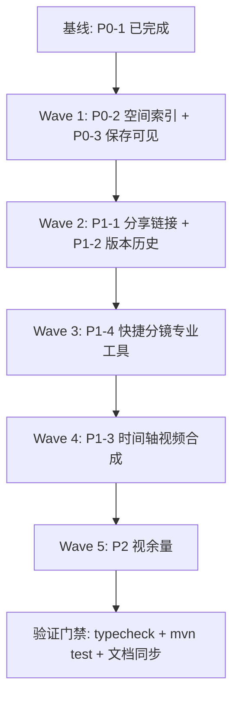

# 画布未实现功能分波实现计划（对标 LibTV / TapNow）

> **Status: DRAFT**（待用户审批后由实现集群执行）
> 依据：`docs/superpowers/specs/canvas-gap-inventory.md`（未实现功能权威清单）+ `docs/superpowers/specs/canvas-commercial-readiness.md`（P0/P1/P2 路线）+ 用户决策（94f92d3：无实时协同/无角色体系/无导出，版本历史+分享链接为核心）

## 需求提炼

**目标**：按优先级补齐 FlowCanvas 画布未实现功能——P0（商业底线）→ P1（竞争力）→ P2（差异化视余量）。

**非目标**（用户决策，94f92d3 裁剪）：实时协同、角色权限体系、数据导出；LibTV 商业化（积分/会员/审核/付费模型/社区发布）。

**现状基线**（d1aeda2，已核验）：
- ✅ P0-1 账号级模板持久化**已完成**（canvas-templates.ts list/save/delete + CanvasTemplateController + CanvasTemplate entity）——本计划不含
- ✅ 25 宫格快捷分镜已实现（canvas-workflow-template.ts:14）
- ✅ 3D 导演台子应用已实现（web/src/app/(user)/canvas/director/ 49 文件）——**旧 spec 盲区，实现 P1-4 时勿重复，注意交互重叠**



## Wave 1 — P0 商业底线（2-3 人日）

### T1: 空间索引接线（P0-2）
- **现状**：`web/src/app/(user)/canvas/utils/canvas-spatial-index.ts` 已实现 `buildSpatialIndex`/`querySpatialIndex`（:14/:19/:34），**全 web/src 零引用**。
- **任务**：将空间索引接入画布渲染/命中检测——视口内节点查询（替换全量遍历）、框选命中、连线端点命中检测走索引；节点增删移时增量更新索引。
- **涉及文件**：`web/src/app/(user)/canvas/[id]/canvas-client-page.tsx`、`web/src/app/(user)/canvas/components/leafer-canvas.tsx`、`canvas-spatial-index.ts`（补增量更新 API）。
- **⚠️ 冲突**：`leafer-canvas.tsx` 有**其他会话未提交改动**——实施前先与用户确认（基于 diff 增量追加或等对方提交），不得覆盖。
- **验证**：`cd web && npx tsc --noEmit` exit 0；`canvas-spatial-index.test.ts` 新增用例（build/query/增量更新，RED→GREEN）；100 节点画布拖动/框选无回归（手动，标注未实测）。

### T2: 自动保存状态可见 + 崩溃恢复提示（P0-3）
- **现状**：canvas-client-page.tsx 无「保存中/保存成功/保存失败/自动保存」UI（grep 零命中）。
- **任务**：画布顶部状态区显示自动保存状态（保存中/已保存/保存失败重试中，极简扁平风格，遵循 AGENTS.md §8 低视觉重量）；后端恢复失败/会话过期时保留现有错误页并提示崩溃恢复。
- **涉及文件**：`web/src/app/(user)/canvas/[id]/canvas-client-page.tsx`、画布状态栏组件（canvas-toolbar.tsx 或同目录新小组件）。
- **验证**：`cd web && npx tsc --noEmit` exit 0；断网模拟保存失败 → 状态显示失败并 5s 补偿重试（手动，标注未实测）。

## Wave 2 — P1 核心（版本历史 + 分享链接，6-10 人日）

### T3: 分享链接访问（P1-1）
- **现状**：backend entity 无 CanvasShare（glob 11 个实体无分享表）；无分享路由。
- **任务**：后端新增分享表（entity CanvasShare + repository + service + controller，`{code,data,msg}` 响应结构，token 校验，只读/可编辑两档权限——语义对齐 Excalidraw+ 只读链接「分享内容而非场景编辑权」，调研见 competitor-research-2026-08-update.md §2.3）；前端画布分享入口（生成链接/复制/权限选择）。
- **涉及文件**：`backend/.../entity/CanvasShare.java`、`repository/`、`service/`、`controller/`（新建）；`web/src/services/api/`（新增 share 客户端）；画布顶部入口。
- **验证**：`cd backend && mvn -q test` exit 0（share 创建/校验/越权用例）；`cd web && npx tsc --noEmit` exit 0；未登录访问分享链接 → 只读画布（手动，标注未实测）。
- **文档**：新增表同步 `docs/content/docs/backend/backend-database.mdx`（AGENTS.md §6 规范）。

### T4: 版本历史快照 + 回滚（P1-2）
- **现状**：backend entity 无 CanvasSnapshot；无版本接口。
- **任务**：后端画布快照表（entity CanvasSnapshot：projectId/version/数据快照/时间/触发者）+ 快照创建（保存时按节流生成）+ 列表 + 回滚接口；前端版本历史入口（列表/时间线/回滚确认弹窗，复用项目 Modal 风格）。
- **涉及文件**：backend 新建 CanvasSnapshot 全套；前端 canvas 页面新增版本历史面板。
- **验证**：`cd backend && mvn -q test` exit 0；前端 typecheck exit 0；回滚后画布内容恢复且生成记录不受影响（手动，标注未实测）。
- **文档**：backend-database.mdx 同步。

## Wave 3 — P1-4 快捷分镜专业工具（3-5 人日）

### T5: 镜头聚焦 / 焦点编辑 / 角色三视图 / 画面推演
- **现状**：web/src 全库 grep「镜头聚焦/焦点编辑/角色三视图/画面推演」零匹配；director/ 目录亦零匹配（非导演台实现）；四/九/25 宫格已实现（canvas-workflow-template.ts）。
- **任务**：在 `canvas-script-beats.ts`（或 canvas-workflow-template.ts）新增四类快捷分镜 beat 模板——镜头聚焦（单节点放大构图）、焦点编辑（局部重绘引导）、角色三视图（正面/侧面/背面）、画面推演（多候选构图）；节点浮动菜单（canvas-node-hover-toolbar.tsx，已有 storyboardMenuOpen 状态）增加对应入口；复用现有 grid beat 组织机制与连线创建。
- **涉及文件**：`web/src/app/(user)/canvas/utils/canvas-script-beats.ts`、`web/src/app/(user)/canvas/components/canvas-node-hover-toolbar.tsx`、`[id]/canvas-client-page.tsx`（createScriptStoryboard 扩展）。
- **⚠️ 冲突**：canvas-node.tsx 有其他会话未提交改动——浮动菜单若需改节点组件，先确认冲突。
- **验证**：`canvas-script-beats.test.ts` 新增用例（每类模板 beats 数量与描述正确，RED→GREEN）；typecheck exit 0。

## Wave 4 — P1-3 时间轴视频合成可视化（5-8 人日）

### T6: 时间轴可视化
- **现状**：仅 canvas-toolbar.tsx:230 一个「视频合成 Beta」入口；无可视化时间轴。
- **任务**：视频合成节点升级为可视化时间轴——多片段拖拽排序、边缘裁切、播放头切割（对齐 TapNow 播放列表交互：顺序调整/拖边缘裁切/播放头切割/预览）。
- **范围边界**：**「导出」已被用户决策裁减**——本任务只做合成预览与媒体产出（片段编排 → 后端合成 → 产物回填画布）；「导出合并 MP4」是否属于裁减范畴实施前需与用户确认语义边界（gap-inventory §5 已标注）。
- **涉及文件**：canvas 视频合成节点组件（新组件，放 `web/src/app/(user)/canvas/components/`）、canvas-client-page.tsx 合成状态。
- **验证**：typecheck exit 0；多片段排序/裁切/预览交互（手动，标注未实测）。

## Wave 5 — P2 视余量（各 3-5 人日，可裁剪）

| 任务 | 内容 | 涉及文件 |
| --- | --- | --- |
| T7 | 评论/批注（锚定节点） | canvas 前端 + backend 评论表 |
| T8 | 模板市场/公共模板库 | backend 模板公开维度 + 前端市场页 |
| T9 | 脚本富文本文档编辑 | 脚本工作台编辑器升级（标题/段落/台词/分镜标注） |
| T10 | 项目级工作流/故事板切换 + 全局素材引用视图 | 多画布组织视图 |
| T11 | 主画布整理/连线显隐 | appearance 设置新增连线显隐（参照已有「辅助基准线」开关模式，参与 undo/redo） |

## 文件冲突矩阵（工作区 3 个未提交文件）

| 文件 | 其他会话改动 | 涉及任务 | 处理 |
| --- | --- | --- | --- |
| leafer-canvas.tsx | ✅ 未提交 | T1（空间索引接线） | **高冲突**：实施前先与用户确认（diff 增量追加或等提交） |
| canvas-node.tsx | ✅ 未提交 | T5（浮动菜单扩展） | 中冲突：优先只改 hover-toolbar 与 utils，不动 node 本体 |
| globals.css | ✅ 未提交 | — | 低冲突：本计划任务不新增全局 CSS（AGENTS.md §7） |

## 统一验证命令（每波完成后执行）

```bash
cd web && npx tsc --noEmit          # typecheck（web 无 lint/test 脚本，见 pending-test 登记）
cd backend && mvn -q test           # 后端测试（7 个既有 Maven 测试 + 新增用例）
git diff --check                    # 空白检查
```

- web 无单元测试框架（`web/src/` 零 `*.test.ts`，package.json 无 test 脚本）——纯函数模块（canvas-script-beats、canvas-spatial-index）补 Vitest 用例时**不引入新依赖**，用 `node --test` 直跑或用 tsc 兜底；UI 交互验证统一标注「未实测」。
- 后端每次新增表后同步 `docs/content/docs/backend/backend-database.mdx`。

## 反证 / 复现（瑶光反证章节）

- **断言 1**：P0-2 空间索引未接线 → 已核验（grep 全 web/src 仅定义无引用，canvas-gap-inventory.md §1）。
- **断言 2**：P1-1/P1-2 需新建表 → 已核验（glob backend entity 11 个实体无 CanvasShare/CanvasSnapshot）。
- **断言 3**：P0-3 无保存状态 UI → 已核验（grep 保存中/自动保存 零命中）。
- **断言 4**：P1-4 快捷分镜专业工具缺失 → 已核验（两轮 grep 零匹配，含 director/ 目录）。
- **断言 5**：3D 导演台非快捷分镜实现 → 已核验（director 目录 grep 聚焦/推演/三视图/焦点 零匹配）。
- **风险**：外部竞品结论（Excalidraw+ 只读链接、TapNow 播放列表交互）为 web 抓取 unverified 级——T3/T6 实施时以本项目既有交互为准，不照搬未实测细节。
- **风险**：3 个未提交文件的具体 diff 未读（其他会话活跃）——T1/T5 开工前必须重新确认工作区状态。
