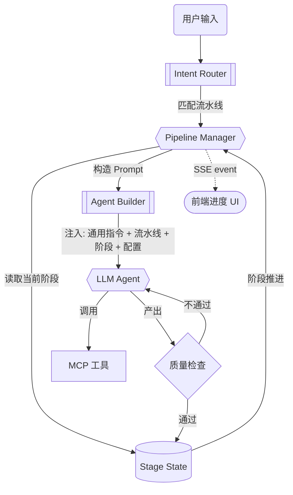

# FlowCanvas Agent 编排引擎 — 设计文档

> 日期：2026-07-30
> 状态：设计已定稿（含一致性约束）

## 背景与问题

### 当前状态

FlowCanvas canvas-agent 提供 23 个 MCP 工具操作画布节点（`canvas-agent/src/mcp-server.ts`），通过 Codex/Claude 理解用户指令逐次调用工具。上一轮已融入 Toonflow 的领域知识 Prompt。

**核心问题：Agent 的操作粒度是"单次工具调用"。** 用户说"帮我做一个古风仙侠第一集"，Agent 能创建文本节点、创建图片节点、连线——但它**不知道**：

- 这是一个需要按阶段推进的制作流程
- 每个阶段的产出物是什么、质量门是什么
- 当前进行到哪一步、下一步该做什么

用户必须在聊天面板中**手动引导每一步**："先写剧本""现在做分镜""生成图片"——这跟用户自己操作画布区别不大。

### 目标状态

Agent 应能**自主编排完整的图片/视频制作流水线**：

> 用户："做一个古风仙侠短剧第一集，3D 动画渲染风格"
>
> Agent：
> 1. 规划：确认集数/时长/风格 → 在画布上创建展示进度
> 2. 阶段1 故事骨架：三幕分割 → 创建骨架节点
> 3. 阶段2 改编策略：提炼原则 → 创建策略节点，询问确认
> 4. 阶段3 剧本编写：逐集生成剧本节点
> 5. 阶段4 分镜表：构建分镜表节点
> 6. 阶段5 分镜图：逐镜触发图片生成
> 7. 阶段6 视频合成：触发视频生成（可选）

用户只需在关键决策点回复"确认"或"调整"。

### 一致性约束

端到端制作的核心难点不是"走完流程"，而是**跨阶段产出保持一致**。当前 Agent 每次生成相互独立，导致：

| 一致性维度 | 断裂表现 | 根因 |
|-----------|---------|------|
| **故事连贯** | 第 3 集角色性格与第 1 集矛盾；情节线中断 | 每集/每阶段 LLM 调用独立，无共享上下文 |
| **人物一致** | 同一人物在不同分镜图中长相不同（换脸） | 图片生成无角色参考图传递机制 |
| **场景一致** | 同一场景在不同镜头中色调/构图/光影跳变 | 缺少场景资产锁定和风格锚定 |
| **道具一致** | 关键道具在不同分镜中形态变化 | 缺少资产 ID 跨阶段引用 |

这些断裂的根因不是"LLM 不够强"，而是**编排层没有把一致性作为硬约束**。每次 Agent 调用时，它不知道上一个阶段产出了什么人物、什么场景、什么道具——也就无法在下一阶段保持连贯。

**一致性修复的核心思路**：每个阶段结束时，从产出物中**提取一致性资产**（人物描述、场景描述、道具清单、角色参考图），作为下一阶段的**必传上下文**注入 Agent Prompt。这不是让 LLM "努力保持一致"，而是在输入层面**剥夺它产生不一致的能力**。

---

## 调研发现

### 1. Toonflow 的三层 Agent 架构

用户已有的 Toonflow 项目（`E:\Toonflow-app\data\skills\`）设计了完整的三层 Agent：

```
用户 → 决策层 Agent → 执行层 Agent → 监督层 Agent
        意图解析+调度    按阶段执行      质量审核+报告
```

- **决策层**：解析意图，维护项目配置，派发执行任务，关键点等用户确认，不直接操作数据
- **执行层**：接收精确任务指令（≤100字），自行读取工作区，按技能流程执行，完成返回确认
- **监督层**：按审核维度+红线清单逐项检查，输出结构化审核报告

### 2. 流水线阶段

#### 剧本改编（3 阶段）
```
项目初始化 → 故事骨架 → 改编策略 → 剧本编写
```

#### 视频制作（6 阶段）
```
导演规划 → 衍生资产分析 → 衍生资产生成 → 构建分镜表 → 分镜面板写入 → 分镜图生成
```

每阶段有：前置条件、输入数据、产出物、质量门、审核规则。

### 3. FlowCanvas 能力缺口

| 能力 | 现有 | 缺口 |
|------|------|------|
| 画布操作工具 | 23 个 MCP 工具 | — |
| 领域知识 Prompt | 已融入 | — |
| 流水线编排 | ❌ | 缺状态机/阶段管理 |
| 进度追踪 | ❌ | 缺画布上的进度节点 |
| 决策层逻辑 | ❌ | Prompt 中无调度指令 |
| 多阶段上下文 | ❌ | 跨轮次丢失流水线状态 |

---

## 方案对比

| 方案 | 核心选择 | 优势 | 代价 | 结论 |
|------|----------|------|------|------|
| **A: Prompt 内编排** | 在 system prompt 中写完整流水线，让 LLM 自己按阶段执行 | 零代码改动 | LLM 会"走神"跨阶段，无法保证顺序；上下文长时丢失进度 | 淘汰 |
| **B: canvas-agent 内置编排引擎** | 实现状态机，每轮交互后由引擎决定下一步 | 可靠执行、进度可追踪、前端可展示 | 增加 canvas-agent 复杂度 | **存活** |
| **C: 前端编排** | 前端维护流水线状态，每阶段独立 Agent 交互 | 前端已有状态管理 | Agent 不能自主决策下一步 | 淘汰 |

### 选择 B

1. 状态机保证阶段顺序，不依赖 LLM"记住"进度
2. 引擎暴露状态 → 前端渲染进度 UI
3. 不改现有 MCP 工具，编排层在工具之上
4. 未来可扩展为多 Agent 协作

---

## 最终方案

### 核心架构



### 三块新增

#### 1. Pipeline Manager

`canvas-agent/src/pipeline/` 新增 4 个文件：

```
pipeline/
├── manager.ts    # PipelineManager: create/advance/get/buildPrompt
├── stages.ts     # 两套流水线阶段定义（script 3阶段 / production 6阶段）
├── state.ts      # JSON 文件持久化 → ~/.infinite-canvas/pipelines/
└── quality.ts    # 质量门 + 一致性检查
```

核心接口：

```typescript
class PipelineManager {
  create(mode, config): PipelineState
  get(pipelineId): PipelineState | null
  advance(pipelineId, stageOutput): PipelineState
  buildPrompt(pipelineId): string  // 为当前阶段构建 Agent 上下文
  // 一致性资产管理
  extractAssets(stageOutput): ConsistencyAssets
  injectAssets(prompt: string, assets: ConsistencyAssets): string
}

type ConsistencyAssets = {
  characters: Array<{ name: string; description: string; referenceImageNodeId?: string }>
  scenes: Array<{ name: string; description: string; styleKeywords: string[] }>
  props: Array<{ name: string; description: string }>
  storyContext: string  // 跨集故事摘要（角色弧线、情节线状态）
  styleAnchor: string   // 全局视觉锚定词（如 "3D 动画渲染，赛璐珞质感，暖色调"）
}

type PipelineState = {
  id, mode, config, currentStage, completedStages, stageOutputs, status
  assets: ConsistencyAssets  // 累积的一致性资产
}
```

#### 2. 阶段定义

```typescript
type PipelineStage = {
  name: string; order: number
  prerequisite?: string       // 前置阶段
  mcpTools: string[]          // 推荐工具
  qualityChecks: QualityCheck[]
  promptContext: string       // 追加到 system prompt
}
```

#### 3. 前端进度 UI

在 Agent 面板聊天区顶部渲染流水线进度条，数据来自 SSE `pipeline_update` 事件。

### 边界标定

**会改的文件：**

| 文件 | 操作 | 说明 |
|------|------|------|
| `canvas-agent/src/pipeline/manager.ts` | 新建 | PipelineManager |
| `canvas-agent/src/pipeline/stages.ts` | 新建 | 阶段定义 |
| `canvas-agent/src/pipeline/state.ts` | 新建 | 持久化 |
| `canvas-agent/src/pipeline/quality.ts` | 新建 | 质量门 |
| `canvas-agent/src/agents.ts` | 修改 | runCodexTurn 整合 PipelineManager |
| `canvas-agent/src/http-server.ts` | 修改 | `/pipeline/*` API + SSE |
| `canvas-agent/src/config.ts` | 修改 | 导出 PipelineManager |
| `web/.../use-canvas-agent-store.ts` | 修改 | 新增 pipelineState |
| `web/.../canvas-local-agent-panel.tsx` | 修改 | 进度条 UI |

**不改的：** MCP 工具集、Prompt 模板、画布节点逻辑、后端 Java

### 关键注入点

**注入点 1 — Prompt 构建：** 活跃流水线时，Agent system prompt 追加：
```
【当前制作流水线】
- 模式：剧本改编 | 进度：阶段 2/3 — 改编策略
- 已完成：故事骨架 ✅
- 当前任务：基于故事骨架制定改编策略
- 产出物：创建「改编策略」文本节点
```

**注入点 2 — 阶段推进：** Agent 产出含 `[STAGE_COMPLETE: adaptation]` 标记时，PipelineManager 自动推进阶段，SSE 推送进度更新。

**注入点 3 — HTTP API：**
- `POST /pipeline/create` — 创建流水线
- `GET /pipeline/:id` — 查询状态
- `POST /pipeline/:id/advance` — 手动推进
- SSE `pipeline_update` — 推送变更

### 数据流

```
用户选择模式 → POST /pipeline/create { mode, config }
→ PipelineManager 创建状态 → 返回 pipelineId + 第一阶段 prompt
→ 用户发消息 → runCodexTurn 注入流水线上下文
→ Agent 执行 → 产出节点 + [STAGE_COMPLETE]
→ PipelineManager 推进阶段 → SSE pipeline_update
→ 前端渲染进度条 → 用户确认
→ 下一轮注入新阶段上下文 → 循环
```

---

## 先例引用

- **`CanvasSession`**（`canvas-agent/src/canvas-session.ts:22`）：已有的 session 管理 + SSE 推送模式，PipelineManager 沿用
- **`AgentPromptBuilder`**（`canvas-agent/src/prompts/builder.ts:40`）：已有的按模式动态组装 Prompt，叠加"按阶段"上下文
- **`useCanvasAgentStore`**：已有的 Zustand + SSE 事件驱动 UI，新增 pipeline 事件走同一通道

---

## 风险与应对

| 风险 | 应对 |
|------|------|
| LLM 不输出 `[STAGE_COMPLETE]` | 同时监听 tool call 模式——调用特定工具+内容匹配产出模板时也视为完成 |
| 长流水线上下文超载 | 每阶段只注入当前阶段+已完成摘要+一致性资产，控制在 4000 token 内 |
| 人物一致性断裂 | 阶段3 提取角色描述→ConsistencyAssets；阶段5 注入参考图节点 ID 到 prompt |
| 故事连贯性断裂 | 阶段间注入 storyContext（上阶段摘要+角色弧线），Agent 生成时基于此校验 |
| 场景风格跳变 | 阶段1 锁定 styleAnchor 全局锚定词，后续所有生图 prompt 自动追加 |
| 用户中断流水线 | 状态持久化到 JSON 文件，支持 pause/resume |

---

## 下一步

本 spec 是架构设计文档。需要执行实现时调用 `writing-plans` 生成实现计划。
