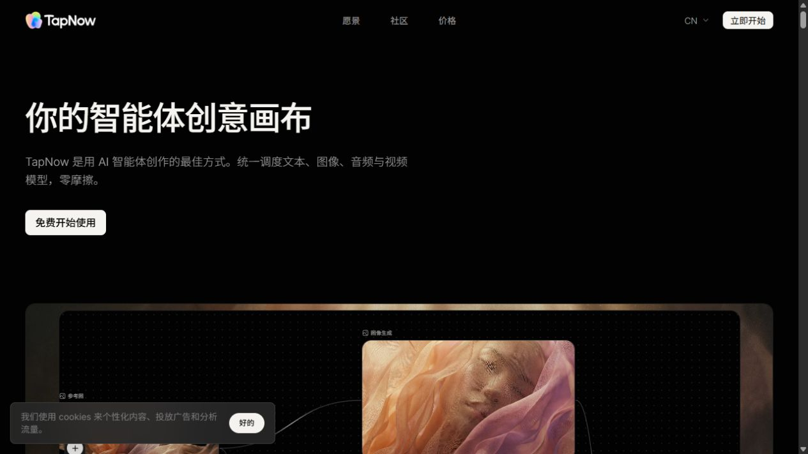
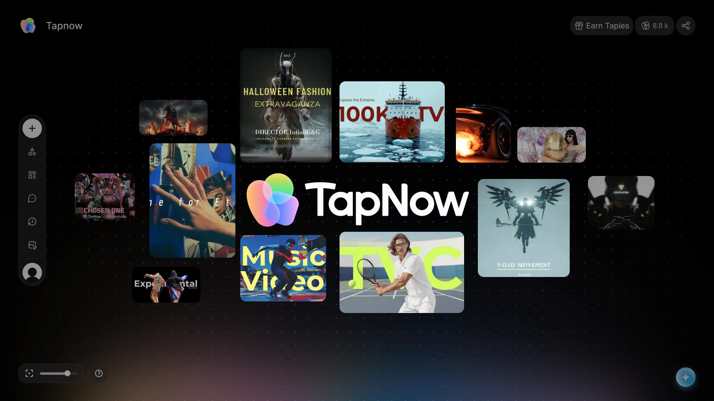
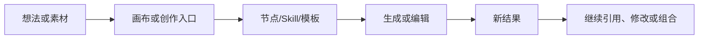
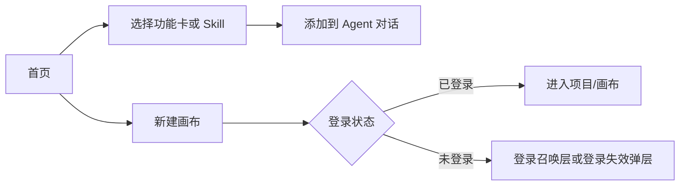
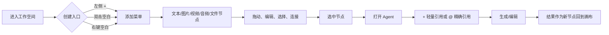

# LibTV × TapNow 视觉交互调研与 FlowCanvas 设计建议

> 调研日期：2026-08-09
> 文档类型：竞品视觉与交互研究 / 设计落地参考
> 研究对象：[LibTV](https://www.liblib.tv/)、[TapNow](https://www.tapnow.ai/zh)
> 目标：提炼适合 FlowCanvas 的无限画布、节点工作流、Agent 与 Skill 交互模式，不复制品牌或商业化入口。

## 0. 结论先行

LibTV 和 TapNow 都把“创作结果”从单次生成框中搬到了更大的工作空间，但两者的重心不同：

| 维度 | LibTV | TapNow | 对 FlowCanvas 的启示 |
|---|---|---|---|
| 产品重心 | 以视频创作入口、Skill 和模型能力组织创作 | 以无限画布、节点关系和 Agent 组织创作 | 以 TapNow 的画布骨架为主，以 LibTV 的入口层级补足发现和启动 |
| 第一视觉 | 深色工作台 + 高饱和青色主操作 + 内容卡片 | 近黑画布 + 点阵背景 + 彩色品牌标识 + 低干扰浮层 | 画布保持低视觉重量，关键动作使用单一高亮色 |
| 启动方式 | “新建画布创作”、功能卡、Skill 卡和 Agent 输入并列 | “免费开始使用”进入工作空间，再通过节点和 Agent 展开 | 空白画布要同时提供中心 CTA、快捷创建和 Agent 入口 |
| 关系表达 | 首页更偏“能力/内容卡片”，画布关系在登录后展开 | 节点与连线是主要信息架构，结果追加到画布 | 生成结果保留来源节点，并通过连线表达因果 |
| 高阶控制 | 用 Skill 将复杂流程包装成可复用入口 | 用 Agent、节点引用、模板和 Apps 串联复杂任务 | `/`、Skill、模板和 Agent 统一为“上下文驱动的创作入口” |

一句话判断：FlowCanvas 不需要变成 LibTV 的营销首页，也不需要完整复制 TapNow 的 Creative OS；最值得落地的是“TapNow 的空间关系 + LibTV 的低门槛启动”。

## 1. 研究范围与证据等级

### 1.1 现场核验

以下截图由本次调研在公开页面现场保存，页面可能包含当日活动、Cookie 或登录状态，因此只把它们用于布局、层级和状态判断，不把动态优惠信息当作产品稳定能力：

- LibTV：`https://www.liblib.tv/`、`https://www.liblib.tv/project`、`https://www.liblib.tv/skill`
- TapNow：`https://www.tapnow.ai/zh`、`https://app.tapnow.ai/`

### 1.2 官方交互文档

TapNow 的官方文档补充了现场页面无法完整展示的画布行为：

- [创建节点](https://docs.tapnow.ai/zh/docs/wo-de-hua-bu/chuang-jian-jie-dian)：空白画布中央按钮、双击空白、左侧加号三种建节点方式；支持画布拖拽、缩放和主题色。
- [认识节点](https://docs.tapnow.ai/zh/docs/wo-de-hua-bu/ren-shi-jie-dian)：节点输入框、指令优化器、节点工具栏和执行次数。
- [使用节点](https://docs.tapnow.ai/zh/docs/wo-de-hua-bu/shi-yong-jie-dian)：通过连接文字节点、图片节点等输入来生成下游内容。
- [Explore the canvas](https://docs.tapnow.ai/en/docs/canvas/explore-the-canvas)：节点、连接、选择、框选、平移、缩放、小地图和 Add 菜单的完整行为说明。
- [和 Agent 对话](https://docs.tapnow.ai/zh/docs/agent/chat-with-agent)：`Ctrl + J` 打开 Agent；`+` 轻量引用画布内容；`@` 精确引用具体节点；支持附件与发送前检查。

### 1.3 仓库内已有视觉证据

TapNow 画布静态图和交互 GIF 来自仓库已有的官方/文档素材归档，本次复制了与对比直接相关的文件到 `assets/libtv-tapnow/`，便于文档自包含。原始归档说明见 [TapNow 画布交互对齐设计文档](2026-08-06-tapnow-canvas-interaction-parity.md)。

## 2. 产品视觉拆解

### 2.1 LibTV：高密度的“视频创作工作台”

LibTV 的首页将左侧工作台导航、顶部活动条、主创作入口、能力卡片、Agent 输入区和 TV Show 内容流放在同一页面。它的视觉策略是先让用户看到“我可以马上做什么”，再让用户浏览“别人做了什么”。

主要特征：

- **入口强**：青色“新建画布创作”是首页最明确的主 CTA；左侧导航顶部也固定一个加号入口。
- **信息密度高**：功能卡片、Skill 卡片和作品卡片都使用缩略图 + 标签 + 简短描述，适合快速扫读。
- **操作分层清楚**：主操作用亮色按钮；次级能力使用深色卡片、细边框和小标签承载。
- **营销与创作同层**：会员、积分、活动条和登录召唤层会占据明显视觉面积。这有利于转化，但不应原样带入 FlowCanvas v1。
- **Agent 是首页能力入口**：Agent 输入框与 Skill 卡片组合，用户既可以直接描述想法，也可以先选一个可复用的创作配方。

### 2.2 TapNow：低干扰的“画布操作系统”

TapNow 的公开站点负责解释产品理念和展示能力，真正的工作空间把画布、节点、连线和 Agent 作为核心。视觉上更接近“编辑器/操作系统”，而不是内容社区首页。

主要特征：

- **画布优先**：近黑底色、点阵背景和大面积留白让节点关系成为视觉主角。
- **工具栏轻量**：左侧竖向图标栏、左下缩放/小地图控制、右下 Agent 入口都尽量不抢内容空间。
- **关系可见**：源节点、结果节点和连线同时保留，用户可以回溯“这个结果由什么生成”。
- **空状态可行动**：空画布中央直接给出“双击创建”提示和常用快捷动作，不让用户面对完全空白的编辑器。
- **Agent 是上下文层**：Agent 不替代画布，而是读取用户显式选中的节点、附件或 `@` 引用，并把结果追加回画布。

### 2.3 对 FlowCanvas 的综合判断

建议采用以下组合：

1. 以 TapNow 的“画布是主场”作为信息架构；
2. 以 LibTV 的“新建画布 / Skill / 模板”作为启动层；
3. 以 FlowCanvas 已有的图片、视频、音频、文本和脚本节点作为真实能力边界；
4. 用统一的主题 token 管理亮色/暗色，不把竞品的黑色、白色或某一个品牌色硬编码进所有组件；
5. 保留 FlowCanvas 单机开源定位，不引入积分、会员、竞赛、社区发布等与本次画布体验无关的商业化模块。

## 3. 现场截图与视觉证据

### 3.1 LibTV 首页：启动、能力和内容流并列

图中可以观察到：

- 顶部活动条固定在内容上方，形成强提醒层；
- 左侧导航使用窄 rail，顶部加号是持续可见的“创建”入口；
- 主区域把“只需一张画布”与“新建画布创作”绑定，降低理解成本；
- 登录召唤层覆盖在能力卡片上方，说明登录是创作前的强制门槛；
- 卡片通过图片、模型标签和一句话描述完成快速选择。

### 3.2 LibTV 项目入口：未登录状态也给出创作骨架

这里值得借鉴的不是登录弹层，而是空项目布局：左上返回和项目标题，右上新建文件夹，中间“开始创作”卡片，空状态文案直接说明下一步。FlowCanvas 的画布列表/项目列表可以采用同样的“空状态可行动”原则。

### 3.3 LibTV Skills：把复杂创作包装成可发现、可复用的卡片

Skill 页面形成了一个清晰的浏览漏斗：

`自由描述想法 → 分类筛选 → 搜索 → 查看卡片 → 使用 / 收藏`

对 FlowCanvas 的直接启发是：工作流模板、快捷分镜和常用节点组可以采用相同的卡片信息结构；但卡片动作应服务于“插入画布 / 运行工作流”，不要把商业化按钮放进主路径。

### 3.4 TapNow 官网：品牌叙事与画布预览

TapNow 官网使用更大的黑色留白、更少的顶部导航和更克制的白色按钮。视觉内容在下方以画布预览展开，先建立“这是一个创意画布”的心智，再解释镜头控制、灯光控制和对象替换等高级能力。

### 3.5 TapNow 创作入口：工作空间、推荐能力和社区内容

现场页面显示出更完整的产品工作台：顶部是主页、工作空间、TapTV、竞技场；中部是 Agent 输入和模型/Skill 推荐；下方是 TapTV、竞技场和模板库。促销弹层和 Cookie 弹层属于动态运营状态，文档只记录为“遮罩层 + 关闭/选择动作”的交互案例，不纳入 FlowCanvas 的核心视觉方案。

### 3.6 TapNow 画布：点阵背景、节点自由摆放与低干扰工具栏

画布总览最值得复用的结构是：

- 左侧垂直工具栏固定但窄，不占主要工作区；
- 节点以自由布局存在，画布通过点阵提供空间方向感；
- 左下角提供适配视图、网格/小地图和缩放控制；
- 右下角保持一个低干扰的 Agent 入口；
- 顶部只保留项目名、保存状态、资源/社区等轻量信息。

### 3.7 TapNow 空画布：空状态也要能直接开始

空画布中心同时提供行为提示和快捷动作：文本转视频、换背景、首帧转视频、音频转视频、模板。它把“学习交互”与“开始创作”合并为一个组件，是 FlowCanvas 空画布最应优先对齐的参考。

### 3.8 TapNow 节点关系：结果不替换来源

TapNow 的节点不是单一表单，而是可在空间中移动的内容对象。节点标题、媒体预览和连线关系共同承担上下文。FlowCanvas 生成结果也应追加为新节点，保留输入节点、参数和可回溯关系。

### 3.9 TapNow 多参考：多个输入作为并行上下文

多参考场景强调“同一任务中不同节点各自承担角色”。这和 Agent 中的 `+` 轻量引用、`@` 精确引用一致：引用不是简单拼接图片，而是让用户表达每个素材的职责。

### 3.10 TapNow 结果网格与连接：批量生成仍然可追溯

批量结果以多个节点呈现，来源与变体之间保留空间关系和连接。FlowCanvas 的批量生成可以继续使用组节点/批量框，但需要保证展开后仍能看到每个结果的来源和运行状态。

### 3.11 TapNow 缩放后视图：用空间导航管理复杂工作流

工作流复杂后，缩放和小地图不是装饰，而是找回上下文的基础设施。建议 FlowCanvas 把“适配视图、缩放百分比、小地图开关、按类型搜索”作为一个完整的导航组，而不是分散到多个弹窗。

### 3.12 TapNow Agent：从画布上下文进入自然语言操作

Agent 的关键不是聊天面板本身，而是它与当前画布上下文的绑定：打开后用户能看到已选节点/附件，输入框允许继续添加引用，结果回到画布而不是只留在聊天记录中。

## 4. 视觉系统对比

下表把截图中的稳定特征和 FlowCanvas 的建议 token 分开。颜色是根据现场截图的视觉估算，不视为竞品官方设计 token。

| 层级 | LibTV 观察 | TapNow 观察 | FlowCanvas 建议 |
|---|---|---|---|
| 页面底色 | 深灰黑，内容区和侧栏有轻微层次 | 近黑，点阵让空间方向成为背景 | `canvas.bg` 负责主题切换，默认近黑；不要在组件内散落黑色常量 |
| 主操作 | 青色/蓝色高亮，按钮存在感强 | 白色按钮 + 低饱和灰色控件，彩色主要来自素材和品牌 | 只保留一个高亮色作为创建、生成、确认动作；默认建议偏青色 |
| 文字 | 白色标题、灰色说明、卡片标签较多 | 大标题偏白，正文低对比，画布内文字保持克制 | 主文字高对比，辅助文字不要低于可读对比度；状态文字始终可见 |
| 容器 | 卡片密集，圆角和细边框形成模块分组 | 节点为内容容器，浮层尽量轻 | 节点/面板使用 12–16px 圆角；工具栏少边框、少阴影 |
| 导航 | 左侧 rail + 顶部运营条 + 多个内容区 | 左侧图标栏 + 左下空间控制 + 右下 Agent | 画布采用三块固定锚点：左 rail、左下导航、右下 Agent |
| 状态 | 登录、活动、会员等强运营状态明显 | 保存状态、节点状态、Agent 状态更贴近创作 | 生成中/保存中/已保存/失败都在离用户最近的位置反馈 |
| 内容密度 | 首页高密度，适合发现和筛选 | 工作空间留白多，适合编排和回溯 | 列表/模板页可高密度，画布页保持低密度 |

### 4.1 建议 token（用于 FlowCanvas，不是竞品取色值）

| Token | 建议值 | 使用位置 |
|---|---|---|
| `canvas.bg` | `#0A0B0D` | 无限画布主背景 |
| `canvas.surface` | `#17191C` | 节点、浮层、面板 |
| `canvas.surfaceElevated` | `#23262A` | 菜单、弹窗、选中节点操作区 |
| `canvas.text` | `#F4F6F8` | 标题、节点名、主按钮文字 |
| `canvas.textMuted` | `#9BA3AD` | 描述、辅助信息、未激活图标 |
| `canvas.border` | `rgba(255,255,255,.10)` | 低权重边界 |
| `canvas.accent` | `#12C4EE` | 新建、生成、连接激活、焦点 |
| `canvas.accentSoft` | `rgba(18,196,238,.16)` | 选中背景、hover、连接高亮 |
| `canvas.danger` | `#F06B6B` | 删除、失败和破坏性动作 |

这些 token 需要通过 `canvasThemes` / `useThemeStore` 或现有主题入口注入，亮色主题另行映射；不要把这组建议值直接散落到组件私有 class 中。

## 5. 交互路径对比

### 5.1 两款产品的共同模型

共同点是“结果继续成为下一步输入”，而不是生成后结束。差异在于 LibTV 更强调入口和能力包装，TapNow 更强调空间中的关系和回溯。

### 5.2 LibTV 公开路径

公开页面可直接观察到 A、B、C、D、G；登录后的真实画布路径不在本次未登录现场核验范围内，因此不把画布内具体控件写成 LibTV 现场事实。

### 5.3 TapNow 画布路径

这是本次最值得对齐的交互契约：入口冗余但语义一致，节点关系持续存在，Agent 读取显式上下文，结果回到同一空间。

## 6. FlowCanvas 落地建议

### P0：先对齐创作主路径

| 交互契约 | 建议行为 | 视觉反馈 |
|---|---|---|
| 空画布启动 | 中央 CTA + 4–5 个高频快捷动作；保留双击空白创建 | CTA 只占画布中心很小区域，背景仍保持可探索 |
| 添加节点 | 左侧 `+`、双击空白、右键空白共用一个创建菜单 | 菜单锚定到触发点，创建后自动聚焦新节点 |
| 节点选择 | 选中态比 hover 态更持久；选中后显示上下文工具栏和连接点 | 选中边框/光晕使用 `accentSoft`，避免大面积纯色覆盖 |
| 连接节点 | 拖出连接时显示可连接目标；完成后保留连线和结果来源 | 默认低对比，hover/选中/相关节点链路才提高亮度 |
| Agent 上下文 | 右下角入口 + `Ctrl/Cmd + J`；选中节点后打开自动带入上下文 | 面板出现不改变画布位置；引用 chip 显示在输入框上方 |
| 生成反馈 | 节点内显示运行中、进度、失败和重试；结果追加为新节点 | 状态不依赖 toast，节点本身必须能解释当前阶段 |
| 保存状态 | 顶部项目名旁显示保存中、已保存、同步失败 | 文案短、常驻、低干扰；失败时提供可点击重试 |

### P1：用 LibTV 的信息密度提升发现效率

- 工作流模板/快捷技能采用三列或四列卡片，图片、名称、标签、简述和“插入画布”动作固定位置；
- 搜索与分类筛选放在同一行，保持 `Skill` 页面那种一眼可扫读的结构；
- 允许从节点悬浮菜单直接打开“快捷功能”，但菜单项只展示当前节点类型支持的能力；
- 复杂操作优先用“技能/模板预设”隐藏参数，再允许高级用户展开 Composer；
- 不把会员、积分、竞赛等入口混入工作流模板的主操作区。

### P1：用 TapNow 的空间导航保障复杂工作流

- 左下角统一放“适配视图、缩放、小地图/网格”，避免导航能力分散在多个弹窗；
- 节点多选后，Agent 和批量操作都读取当前选择，不要求用户重复上传；
- `+` 负责轻量引用当前选择，`@` 负责在输入中精确选择具体节点；
- 批量结果用组节点承载，但提供展开/折叠和主结果标记；
- 当用户缩放到远景时保留小标题或类型标签，避免整个画布变成不可读的缩略图。

## 7. 交互状态与动效建议

以下是 FlowCanvas 的建议行为，不是对竞品内部实现的断言：

| 状态 | 触发 | 建议表现 | 建议时长 |
|---|---|---|---|
| 默认 | 无焦点 | 工具栏弱化，画布留白优先 | — |
| Hover | 指针进入节点/按钮 | 轻微亮度或边框变化，显示 tooltip | 150–200ms |
| Selected | 点击节点或框选 | 选中边框、上下文工具栏、左右连接点出现 | 180–240ms |
| Connecting | 从连接点拖出 | 显示方向预览、可连接目标高亮、无效目标降权 | 120–200ms |
| Creating | 选择菜单项后 | 新节点从锚点淡入并轻微缩放到 100%，自动聚焦 | 220–320ms |
| Generating | 提交生成 | 节点内显示运行状态和进度；连线不消失 | 持续状态 |
| Saved | 后端确认保存 | 顶部由“保存中”过渡到“已保存”，不弹打断式提示 | 180–240ms |
| Error | 生成/保存失败 | 节点保留输入和错误原因，提供局部重试 | 180–240ms |
| Panel open | 打开 Agent/Composer | 从靠近入口的一侧滑入，画布不跳动 | 220–320ms |

动效原则：只用来说明“哪里出现了、关系怎么建立、状态如何变化”；不为装饰添加持续漂浮或大幅缩放，避免在节点较多时制造噪音。

## 8. 验收清单

### 视觉

- [ ] 深色/浅色主题下，画布、节点、连线、工具栏和弹层都有对应 token；
- [ ] 画布主背景与节点表面有层级，但没有大面积阴影和厚重卡片；
- [ ] 新建/生成动作只有一个明确高亮色，删除/失败使用独立危险色；
- [ ] 选中节点、连接中、生成中和错误状态可以在截图中一眼区分；
- [ ] 画布外的工具栏不遮挡节点，空画布仍然保留可操作性。

### 交互

- [ ] `+`、双击、右键三种建节点方式最终进入同一个创建菜单；
- [ ] 节点生成后输入节点不被替换，来源关系和连线仍然存在；
- [ ] Agent 支持当前选中节点、`+` 轻量引用和 `@` 精确引用；
- [ ] 生成失败可以从原节点局部重试，不需要重新搭建工作流；
- [ ] 保存状态在顶部常驻，离开页面前用户能知道是否已同步；
- [ ] 缩放、适配视图、小地图和按类型搜索能够协同定位节点。

## 9. 参考链接与截图说明

- [LibTV 官方首页](https://www.liblib.tv/)
- [LibTV 项目入口](https://www.liblib.tv/project)
- [LibTV Skills](https://www.liblib.tv/skill)
- [TapNow 官方中文首页](https://www.tapnow.ai/zh)
- [TapNow 创作入口](https://app.tapnow.ai/)
- [TapNow 官方文档](https://docs.tapnow.ai/zh/docs)
- [TapNow 画布交互文档](https://docs.tapnow.ai/en/docs/canvas/explore-the-canvas)
- [TapNow Agent 对话文档](https://docs.tapnow.ai/zh/docs/agent/chat-with-agent)

截图目录：`docs/superpowers/specs/assets/libtv-tapnow/`。LibTV 三张截图和 TapNow 官网/创作入口截图为本次现场保存；TapNow 画布截图与 GIF 为仓库已有官方/文档素材归档的整理副本。
