# FlowCanvas 内部节点 UI / 交互动效自测证据

> 取证日期：2026-08-11
> 证据类型：FlowCanvas 本地现场操作、代码动效参数核验，以及少量用于对照的公开材料
> 注意：本册是 FlowCanvas 内部 UI 自测，不是竞品调研，不应作为 LibTV、TapNow 或小云雀的产品截图使用。
> 竞品公开材料请看：[LibTV、TapNow 与小云雀无限画布公开材料调研](2026-08-11-libtv-tapnow-xiaoyunque-interaction-research.md)

## 0. 为什么单独做这份内部证据册

交互调研不能只有“应该支持 hover、选中、连线、生成中”这样的文字。必须能回答：

- 用户在点击前、点击后分别看见什么。
- 操作入口位于节点内、节点外、浮动工具栏还是侧栏。
- 动画从哪里开始、持续多久、结束后保留什么状态。
- 竞品实际展示了什么，哪些内容由于登录限制不能确认。
- FlowCanvas 当前真实可操作状态与代码声明是否一致。

本册把 FlowCanvas 截图、GIF、节点操作清单和现场缺陷放在一起。图片均保存在仓库内，不依赖临时浏览器会话。它用于开发验收和回归，不用于说明竞品实际 UI。

## 1. 证据覆盖状态

| 产品 | 已保存的视觉证据 | 能确认的范围 | 不能确认的范围 |
|---|---|---|---|
| LibTV | 首页、项目入口、Skills | 创作入口、卡片层级、登录门槛、能力发现 | 登录后每类节点的 hover、连接点、右键菜单和动效 |
| TapNow | 空画布、节点对、多参考、批量结果、缩放工作流、Agent GIF | 节点视觉、来源保留、关系图、空画布入口、Agent 打开 | 当前线上账号内的全部最新菜单细节 |
| 小云雀 | 首页首屏、作品/工作流展示段 | 灵感入口、成片导向、作品轮播、Agent 产品定位 | 登录后是否为自由节点画布、节点级手势和连接规则 |
| FlowCanvas | 20 余张现场截图、4 个 GIF、代码动效参数 | 基础节点、特殊节点、Agent、分组、Composer、导演台、异常反馈 | 需要真实媒体或模型生成才能出现的成功结果和长任务进度 |

## 2. LibTV 视觉证据

### 2.1 首页创作入口

现场可见的是“新建画布 + 能力卡片 + Skill/模型入口”的低门槛启动结构。登录层遮挡了后续画布，因此不能据此推断节点选中和连线动作。

### 2.2 项目入口

项目层负责管理创作容器，节点操作发生在项目内部。FlowCanvas 不应把项目卡片行为和节点行为混成同一个交互层。

### 2.3 Skills 入口

Skill 是复杂操作的包装入口。对 FlowCanvas 的意义是：快捷功能可以缩短路径，但执行后必须回到可检查的节点、连线和参数，而不是只返回一个孤立结果。

## 3. TapNow 节点和交互视觉证据

### 3.1 空画布与基础工具

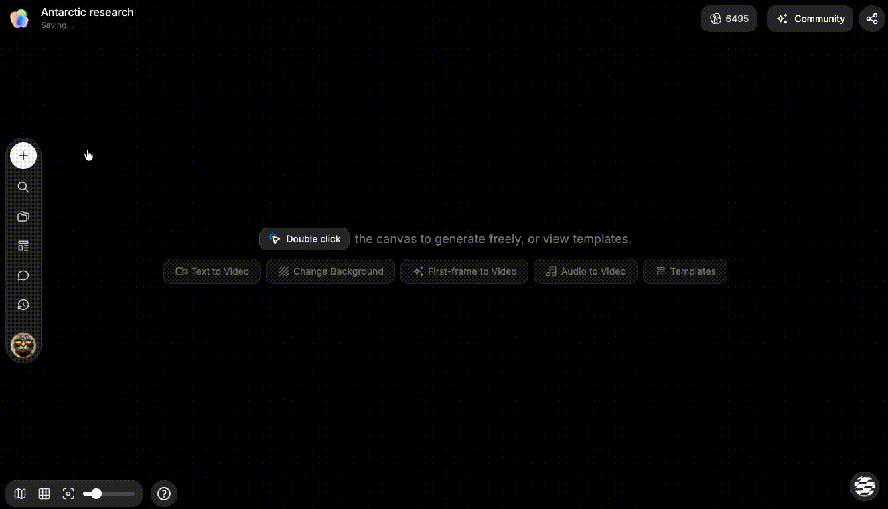

空画布明确告诉用户如何开始；添加、搜索、资产、Agent 和视图控制各自有固定位置。创建入口可以重复，但不同入口必须进入同一创建逻辑。

### 3.2 独立节点

节点标题位于内容容器外侧，媒体本体占据主要面积。结果不会覆盖来源节点，用户可以在画布空间中继续排列和连接。

### 3.3 多参考素材

多参考不是把图片堆进一个上传框，而是让每份素材保持独立身份。连接和 `@` 引用应表达每份素材在任务中的职责。

### 3.4 批量结果和来源关系

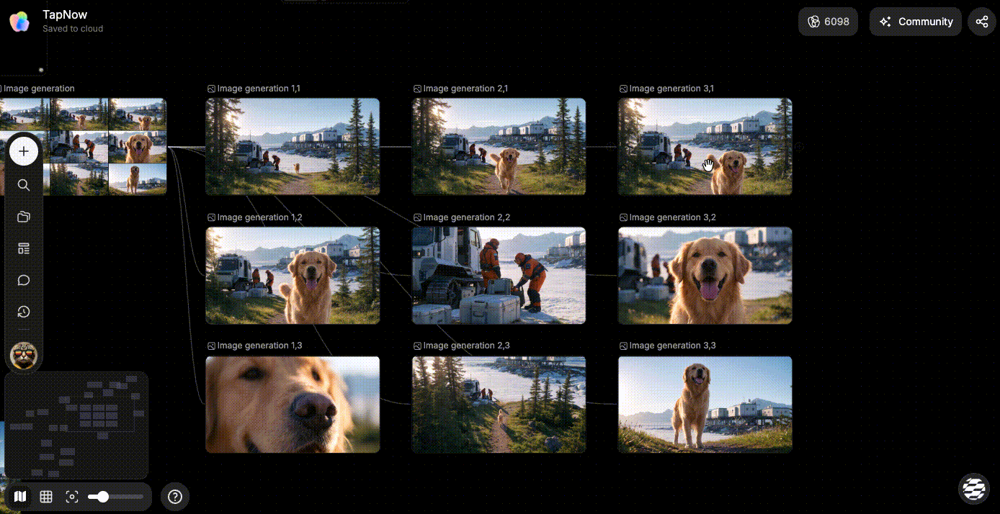

批量生成后仍可看到来源关系。FlowCanvas 即使使用批量组，也要允许展开后检查每个结果的来源、状态和可重试入口。

### 3.5 缩放后的工作流

远景模式的目标不是看清表单，而是看清类型、分支和整体结构。节点标题和类型标签应抵消视口缩放，避免缩小后完全失去语义。

### 3.6 Agent 打开动效

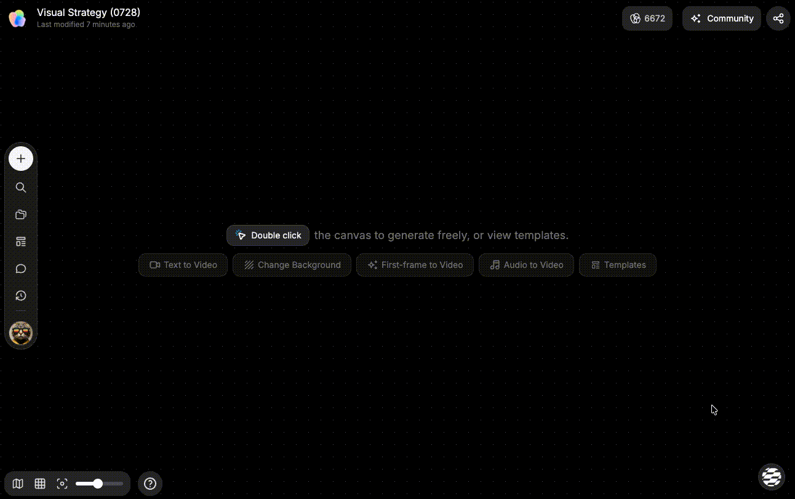

Agent 是画布的上下文层：面板出现时仍保留画布，用户能判断当前选区和任务影响范围。它不是跳转到另一个聊天页面。

## 4. 小云雀视觉证据

### 4.1 灵感输入与成片导向

首屏以动态内容墙作为结果预期，输入框不是普通搜索，而是从灵感直接启动成片任务。它适合借鉴到 FlowCanvas 的空画布 Agent 入口。

### 4.2 作品轮播与工作流回看入口

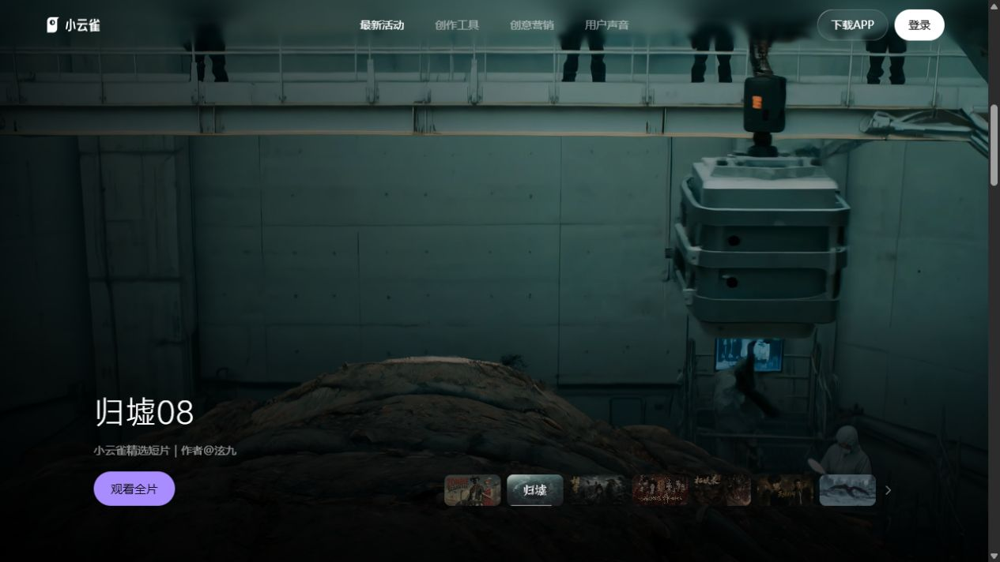

公开页强调作品结果和连续镜头，但不能证明登录后的编辑空间使用 TapNow 式节点交互。因此，小云雀只作为“故事生产层”的证据，不作为通用无限画布手势证据。

## 5. FlowCanvas：创建入口和完整操作序列

### 5.1 空画布 → 创建菜单 → 图片节点

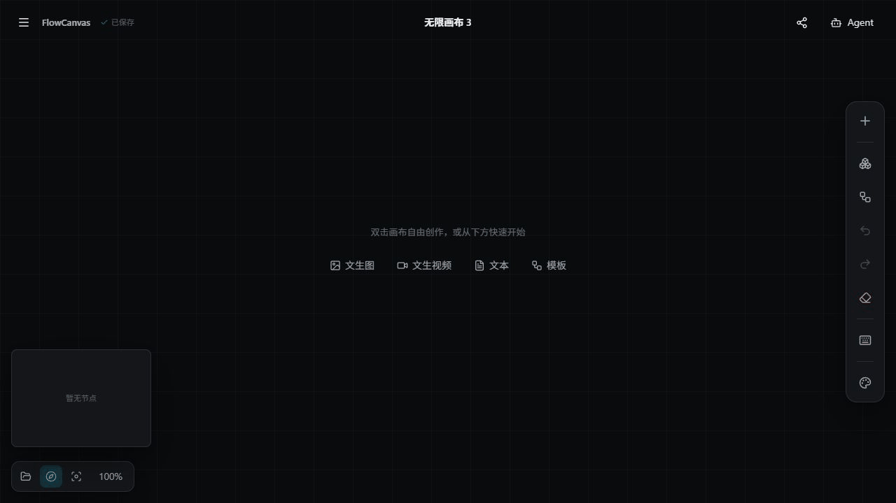

对应静态帧：

- [空画布](assets/libtv-tapnow-xiaoyunque-interaction/flowcanvas-00-empty-canvas.jpg)
- [创建菜单](assets/libtv-tapnow-xiaoyunque-interaction/flowcanvas-01-create-menu.jpg)
- [图片节点选中](assets/libtv-tapnow-xiaoyunque-interaction/flowcanvas-03-image-node-selected.jpg)

创建菜单本身使用 240ms 的淡入、0.96 → 1 缩放和 4px → 0 位移动画。现场测试中，空画布快捷入口可以创建文本、图片和视频节点；右侧创建菜单的菜单项存在“获得焦点或关闭菜单，但不创建节点”的问题，详见第 9 节。

## 6. FlowCanvas：逐节点操作 UI

### 6.1 文本节点

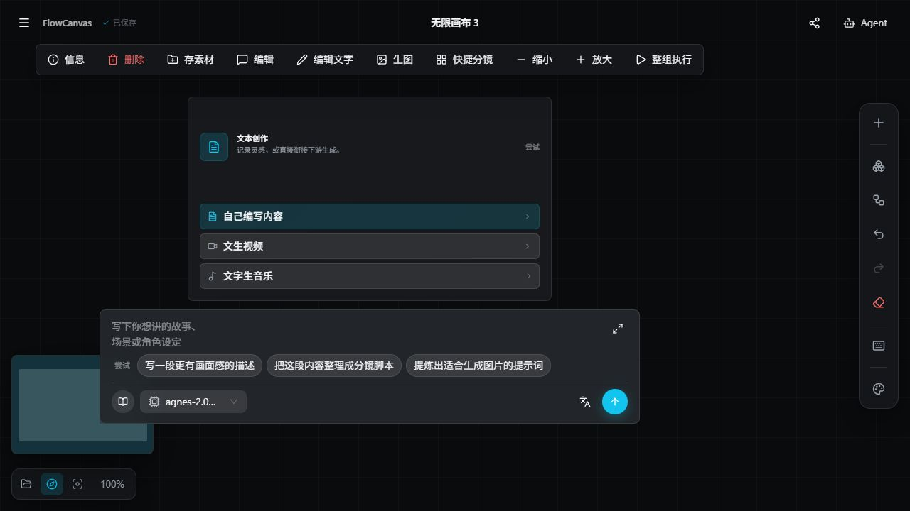

| 区域 | 现场可见操作 |
|---|---|
| 节点内 | 自己编写内容、文生视频、文字生音乐 |
| 浮动工具栏 | 信息、删除、存素材、编辑、编辑文字、生图、快捷分镜、缩小、放大、整组执行 |
| Composer | 文本输入、展开、建议词、提示词库、文本模型、翻译、发送 |
| 下游创建 | 可创建图片、视频、音频和分镜相关节点 |

### 6.2 图片节点

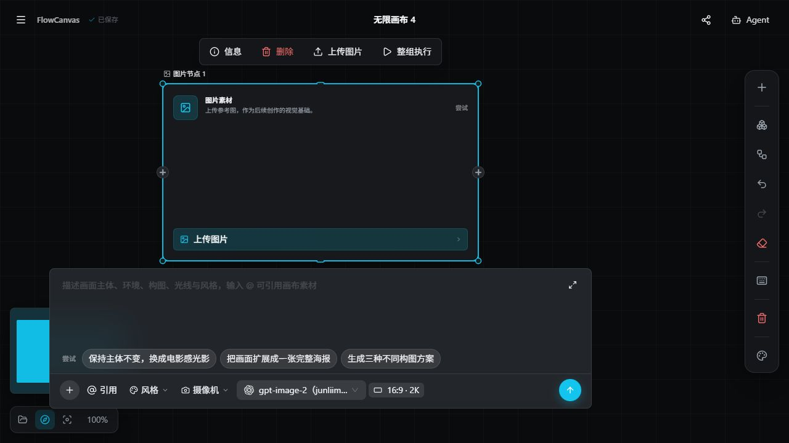

| 区域 | 现场可见操作 |
|---|---|
| 空图片节点 | 上传图片、左右连接点、调整边框 |
| 浮动工具栏 | 信息、删除、上传图片、整组执行 |
| Composer | 描述、建议词、引用、风格、摄像机、模型、比例/清晰度、生成 |
| 已有图片后的工具集合 | 存素材、下载、编辑、复制提示词、反推提示词、替换图片、360 场景、局部编辑、裁剪、切图、放大、扩图、打光、查看大图；可选自由比例、多角度、抠图、720 全景 |

注意：本图是空图片节点的真实现场状态；“已有图片后的工具集合”来自当前工具栏代码的可见操作定义，不能用本图冒充已加载图片状态。

### 6.3 视频节点

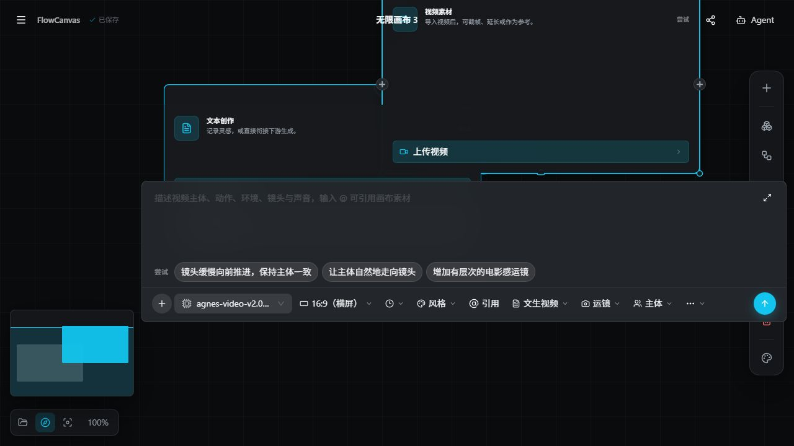

| 区域 | 现场可见操作 |
|---|---|
| 空视频节点 | 上传视频、左右连接点 |
| 浮动工具栏 | 信息、删除、编辑、上传/替换视频、整组执行 |
| Composer | 提示词、建议词、模型、画幅、时长、风格、引用、文生视频、运镜、主体、更多、生成 |
| 有视频后 | 解析为分镜表、入点/出点剪辑、下载、保存素材 |

### 6.4 音频节点

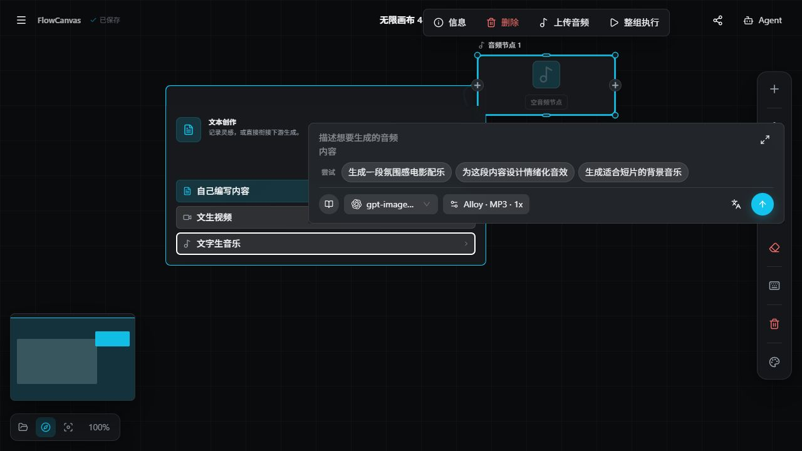

| 区域 | 现场可见操作 |
|---|---|
| 空音频节点 | 上传音频、连接点 |
| 浮动工具栏 | 信息、删除、上传/替换音频、整组执行 |
| Composer | 音频描述、建议词、模型、音色/格式/倍速、翻译、生成 |
| 有音频后 | 播放、下载、保存素材、作为视频合成输入 |

### 6.5 ComfyUI 节点

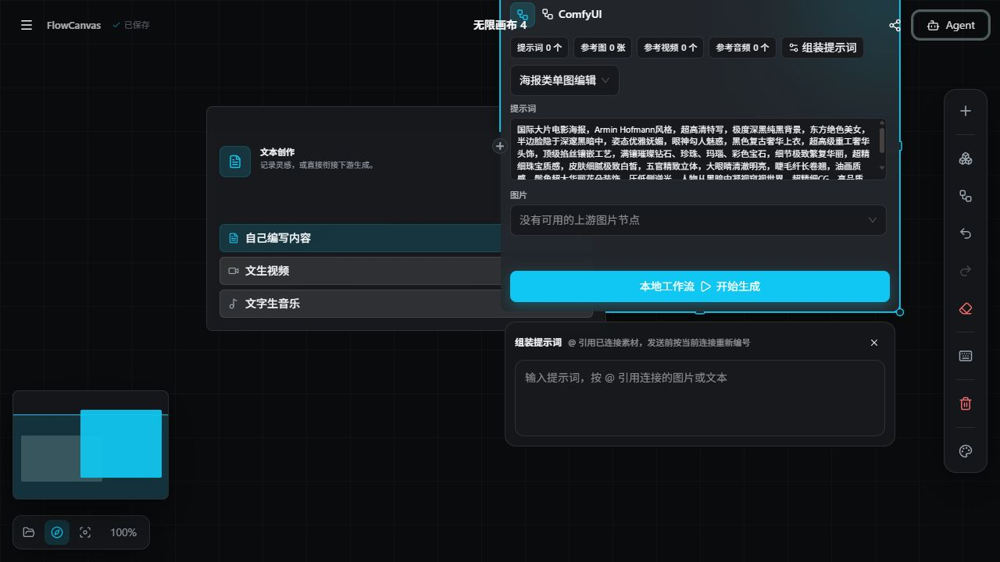

| 区域 | 现场可见操作 |
|---|---|
| 节点内 | 工作流选择、提示词、图片/视频/音频引用计数、组装提示词、开始生成 |
| 浮动工具栏 | 信息、删除、打开 ComfyUI、整组执行 |
| Composer | `@` 引用已连接素材、发送前重新编号 |
| 现场风险 | Agent 创建空 ComfyUI 节点时带入了当前默认工作流提示词，空节点语义不够干净 |

### 6.6 脚本节点

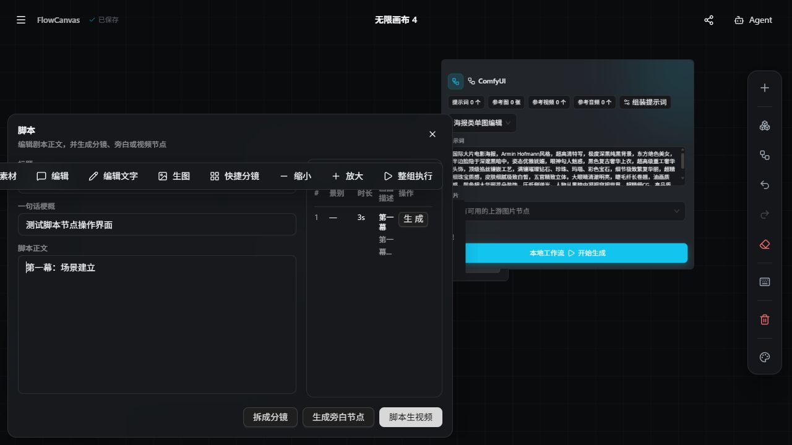

脚本节点是 `text` 基础节点加 `canvasTool: script` 元数据，不是新的底层节点类型。现场 UI 包含：

- 一句话梗概和脚本正文编辑。
- 分镜序号、时长、描述和逐镜生成。
- 拆成分镜、生成旁白节点、脚本生视频。
- 文本节点通用的编辑、编辑文字、生图、快捷分镜、字号和整组执行工具。

### 6.7 视频合成节点

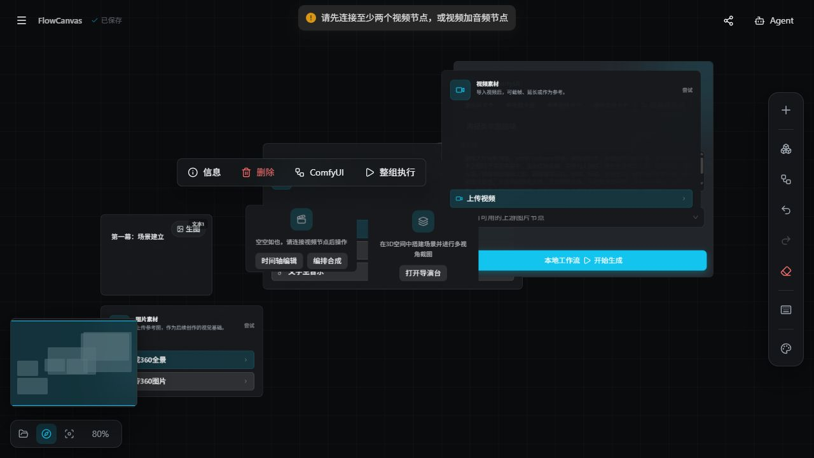

视频合成节点是 `comfyui` 基础节点加 `canvasTool: videoComposition` 元数据。节点内显示输入数量、空状态、时间轴编辑和编排合成。点击时间轴但输入不足时，现场反馈为“请先连接至少两个视频节点，或视频加音频节点”。

### 6.8 3D 导演台节点

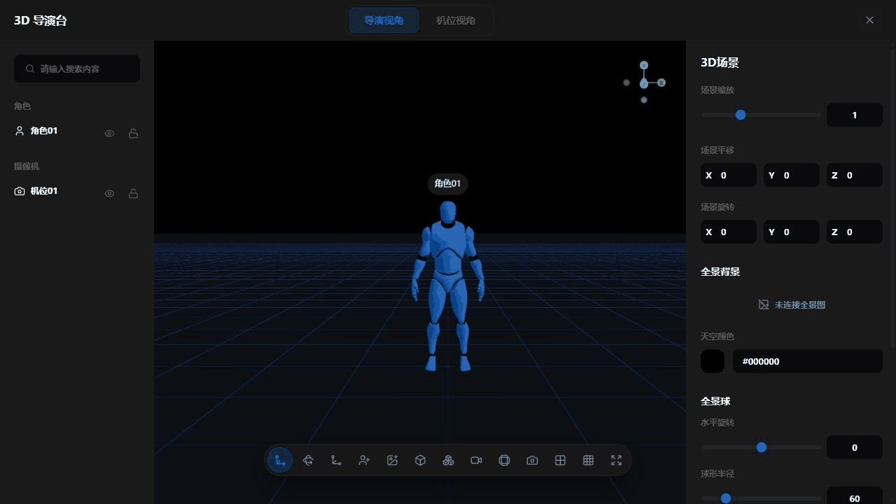

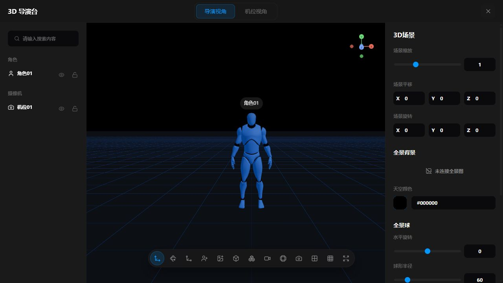

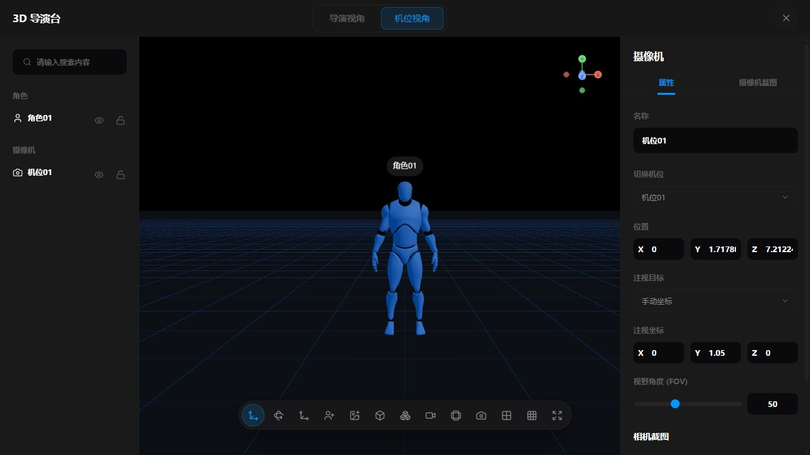

导演台是 `comfyui` 基础节点加 `canvasTool: director` 元数据，打开后进入独立工作面：

- 左侧场景树管理角色和机位，并提供可见/锁定状态。
- 中间 3D 视口提供移动、旋转、缩放、角色、全景图、模型、机位和截图。
- 右侧在导演视角下编辑场景，在机位视角下编辑摄像机位置、注视点、FOV 和截帧。
- 顶部视角切换改变属性面板语义，而不是只改变按钮颜色。

### 6.9 360 场景节点

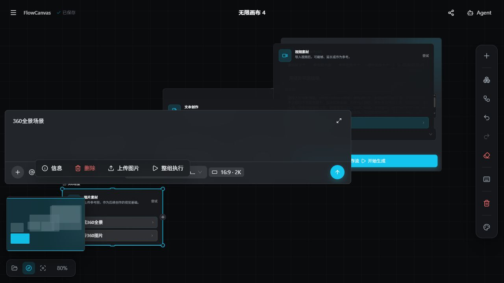

360 场景是 `image` 基础节点加 `canvasTool: panorama360` 元数据。现场 UI 包含生成 360 全景、上传 360 图片、2:1 输出尺寸、图像模型和提示词 Composer。它与普通图片节点共享上传、连接、生成和工具栏逻辑，但进入全景预览的手势需要单独提示。

### 6.9.1 高级节点总览

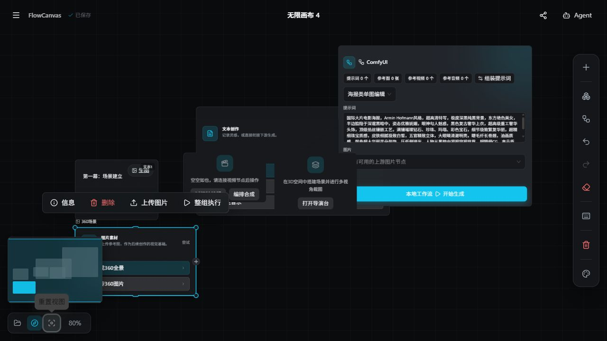

这张总览用于核对高级节点同时出现时的默认尺寸、标题层级和空间占用。它也暴露出 Agent 批量创建缺少自动布局时，节点容易重叠的问题。

### 6.10 分组和分镜组

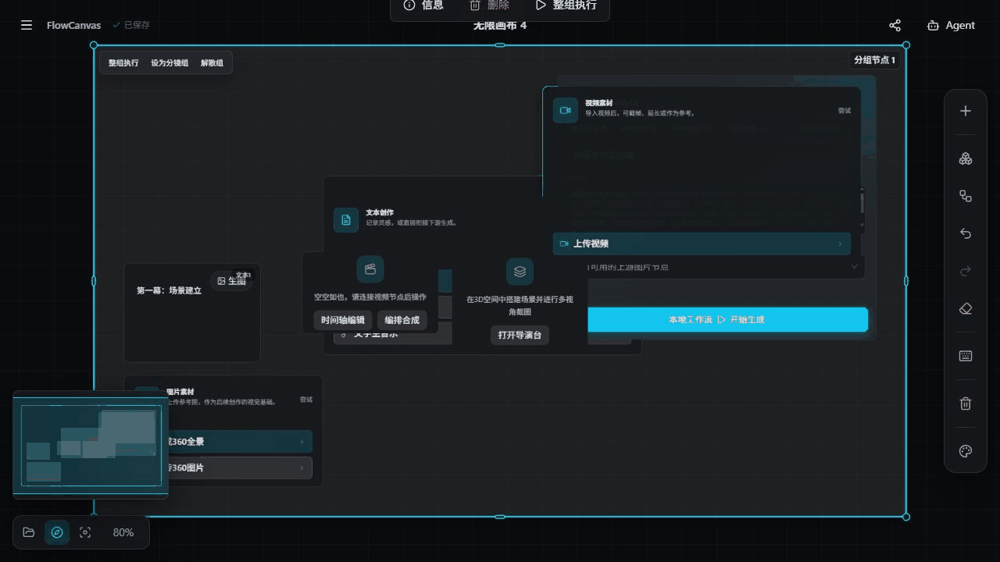

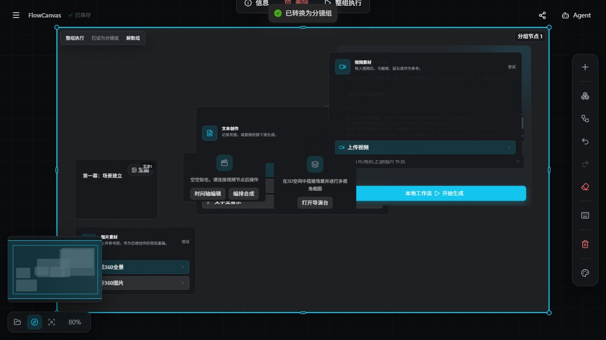

组节点负责空间边界和批量操作，不承担生成参数。普通组可以转换为分镜组；转换后按钮变为“已设为分镜组”，并保留整组执行和解散组。

### 6.11 Config 节点说明

`CanvasNodeType.Config` 仍在类型定义和旧逻辑中，但当前用户创建路径不把它作为独立节点展示；Agent 应用操作时也会把 Config 归一为 ComfyUI。视觉调研不伪造一张独立 Config 节点图，当前可见对应物是 ComfyUI / 生成配置界面。

## 7. FlowCanvas：Agent 操作 UI 和确认动效

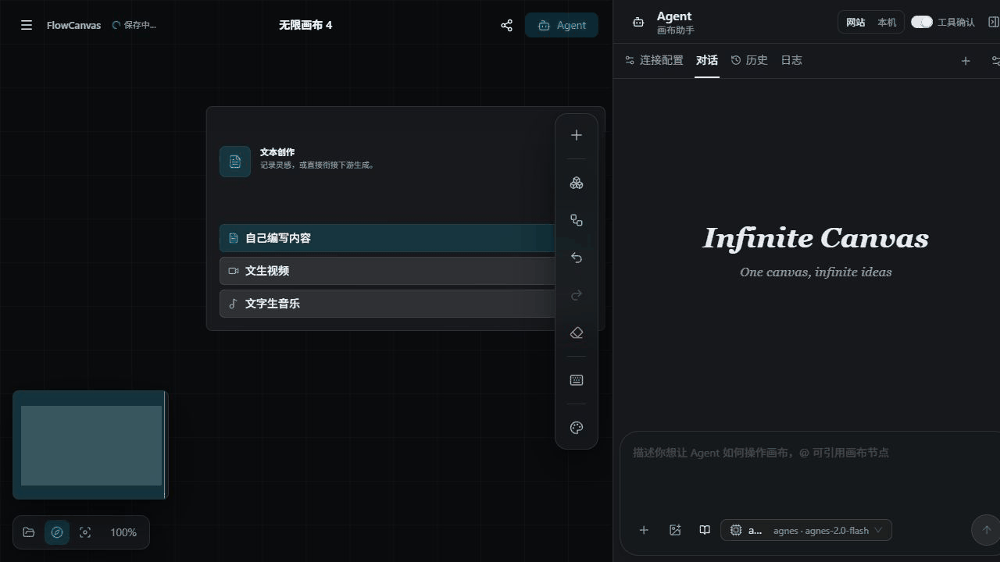

### 7.1 Agent 空状态

### 7.2 工具确认

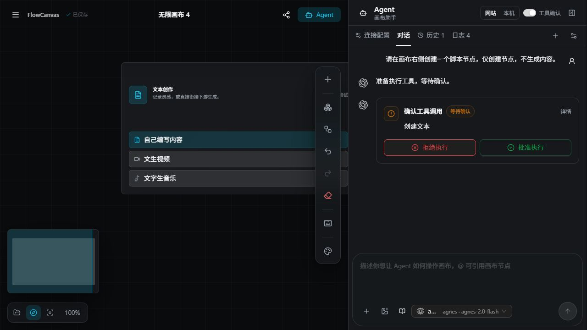

确认卡明确区分“准备执行”和“已经执行”，这是正确方向。还需要在卡片摘要中直接显示节点数量、节点类型、连线数量和生成成本，而不是必须展开详情才能判断影响。

## 8. FlowCanvas：共享状态、连线与右键命中

### 8.1 Hover / Selected

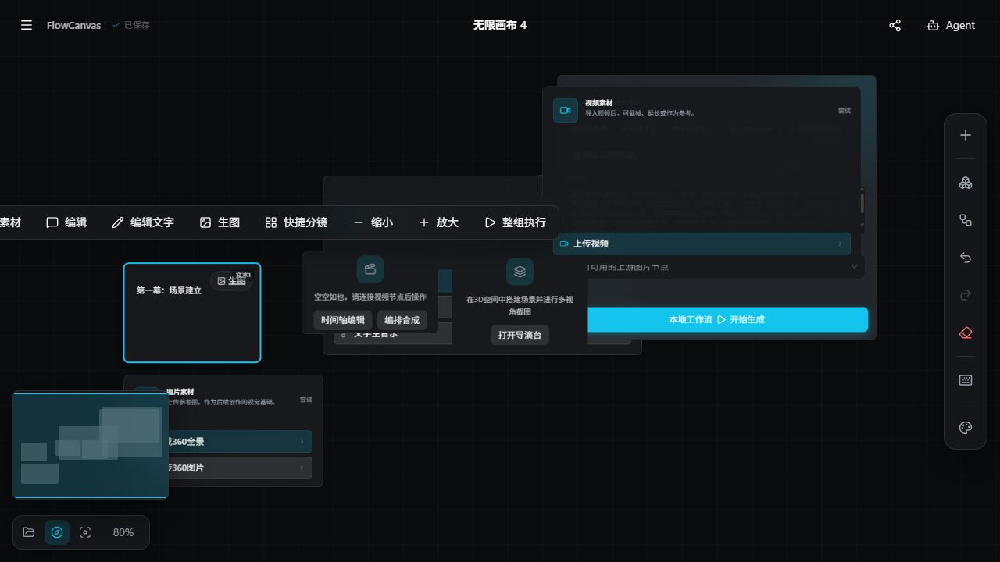

当前状态反馈由亮度、标题上移、青色边框和浮动操作栏组成。工具栏项目较多时会超出左侧视口，应按节点类型控制长度并提供溢出菜单。

### 8.2 连接后的工作流

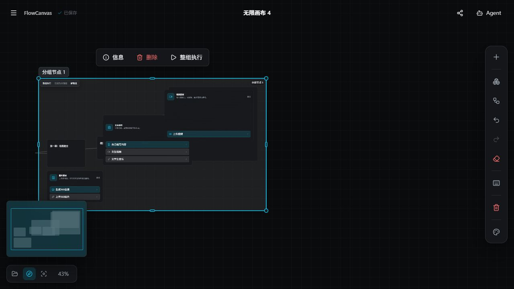

远景能看到组边界和节点关系，但节点全部进入大组后，连线和节点语义明显变弱。Fit view 需要优先保证关系可读，不只是把所有内容机械缩进窗口。

### 8.3 右键命中异常

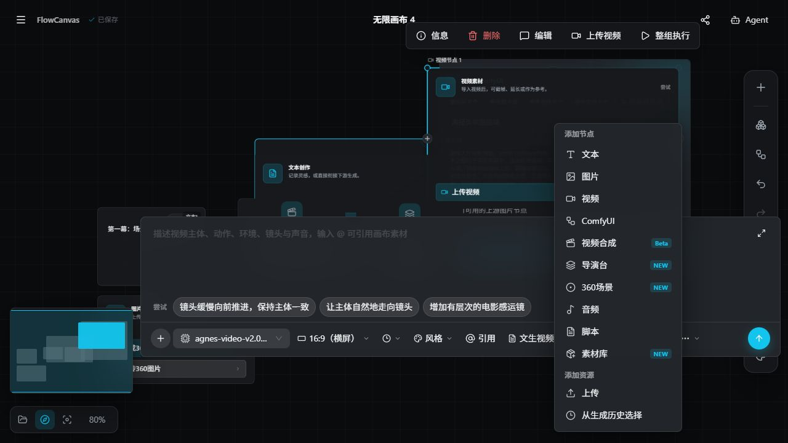

现场在视觉上的视频节点区域右击，打开的是空白区“添加节点”菜单，而不是节点菜单。结合 Leafer 托管节点和 DOM 交互层，说明视觉位置与命中层可能不一致。这不是文案问题，而是画布 hit-testing 问题。

## 9. 当前动效参数核验

| 动效 | 当前实现 | 状态目的 | 结论 |
|---|---|---|---|
| 节点 hover/selected | 边框 160ms、阴影 200ms、filter 180ms | 告知节点可操作和当前选择 | 时长合理，但 hover 与 selected 的差异偏小 |
| 节点标题 | 颜色/透明度 160ms，位移 180ms | 放大当前节点语义 | `translateY(-1px)` 克制，适合密集画布 |
| 创建菜单 | 240ms ease-out，opacity 0→1，scale .96→1，Y 4px→0 | 表示菜单从触发点出现 | 动画合理；菜单动作未闭环是功能问题 |
| 批量子节点展开 | 340ms，位移 + 旋转 + scale .72→1 | 表示结果从批量根节点展开 | 关系表达清楚，节点多时要避免同时过量动画 |
| 批量子节点收起 | 260ms，反向回到根节点 | 表示结果归组 | 收起比展开更快，符合预期 |
| 生成中 | 2s 往返 shimmer + 点阵遮罩 | 持续说明任务仍在运行 | 不依赖 toast，方向正确；需要错误和取消终态 |
| Agent 面板 | 500ms，宽度/透明度 + X 48→0 | 保留画布上下文并展开侧栏 | 视觉稳定，但 500ms 对频繁开关略慢 |
| Reduced motion | 全局动画/过渡压到 .01ms，持续动画关闭 | 无障碍和眩晕保护 | 已覆盖创建菜单、生成 shimmer 和多数画布动画 |

## 10. 现场复现的缺陷与缺失证据

### P0

1. 右侧“添加节点”菜单可打开，菜单项可 hover/聚焦，但多次鼠标点击、Enter 和 Space 都没有创建节点；空画布快捷入口和 Agent 工具能创建节点。
2. 在视觉上的视频节点区域右击，命中了空白区创建菜单；节点 DOM/Leafer 命中层与渲染位置不一致。
3. 快捷键面板展示的部分动作没有对应处理或现场无效，必须建立“显示条目—事件处理—撤销栈—测试”的一一对应。

### P1

1. 在线 Agent 的 `nodeType` 直接枚举只有 image、text、comfyui、video、audio；脚本、视频合成、导演台、360 场景只能通过基础类型加 metadata 创建，Agent 语义与 UI 菜单不一致。
2. Agent 批量创建多个节点时，如果没有明确位置或自动布局，节点会重叠；执行成功不等于结果可用。
3. 组节点 Fit view 会为了容纳大边界把内部节点缩到 43%，关系和操作标签难以辨认。
4. 图片节点“空状态”和“已有媒体状态”的工具差异很大，文档与测试需要分别覆盖，不能用一张空节点图代表全部图片工具。

## 11. 资产目录

- LibTV / TapNow：`docs/superpowers/specs/assets/libtv-tapnow/`
- 小云雀 / FlowCanvas：`docs/superpowers/specs/assets/libtv-tapnow-xiaoyunque-interaction/`

所有 GIF 都由本次实际保存的状态帧组成，用于呈现操作阶段变化；它们不是伪造竞品动画，也不替代逐帧现场结论。
