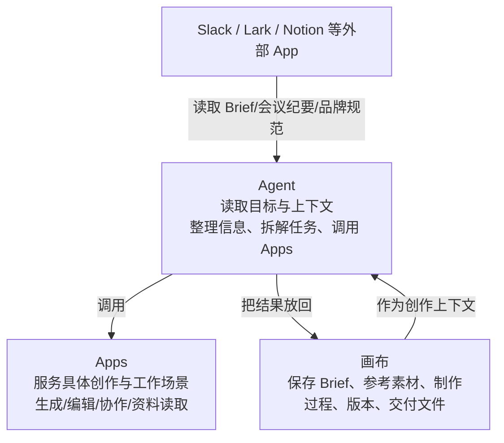

# TapNow Creative OS UI 调研规格

> 调研时间：2026-08（实时抓取 docs.tapnow.ai/zh 14 个文档页 + 官网 www.tapnow.ai/zh，均 HTTP 200）
> 调研方式：web_fetch 实时抓取官方中文文档与官网；sitemap.xml 确认全部页面路径。
> 证据分级（每个断言标注其一）：
> - **verified** — 官方页面原文（本次实际抓取到的文档文字，URL 见各节）
> - **verified-visual** — 从官方截图 / 动图推断（文档内嵌截图、官网 agent-motion 动图，数值类规格无官方原文记载）
> - **unverified** — 第三方转述 / 不可达来源（知乎评测 zhuanlan.zhihu.com/p/2038156945153111106 本次抓取返回 403，标注不可达，不引用其内容）
>
> **已知事实（勿重复检索）**：官方文档对视觉数值规格（具体色值 / 像素尺寸 / 圆角数值）**无记载**。本文档对视觉呈现一律采用**特征级描述**（布局区域、组件构成、交互行为、视觉风格特征）；确需数值的条目标注 `verified-visual`（从官方截图/动图推断）或 `unverified`。

## 0. 调研源清单

| 来源 | URL | 状态 | 证据级别 |
| --- | --- | --- | --- |
| 官网首页 | https://www.tapnow.ai/zh | 200 | verified（文案）/ verified-visual（hero 动图素材） |
| Creative OS 是什么 | https://docs.tapnow.ai/zh/docs/start/what-is-tapnow-creative-os | 200 | verified |
| 认识画布 | https://docs.tapnow.ai/zh/docs/canvas/explore-the-canvas | 200 | verified |
| 认识节点与连接 | https://docs.tapnow.ai/zh/docs/canvas/understand-nodes-and-connections | 200 | verified |
| 生成和编辑图片 | https://docs.tapnow.ai/zh/docs/canvas/generate-and-edit-images | 200 | verified |
| 生成和编辑视频 | https://docs.tapnow.ai/zh/docs/canvas/generate-and-edit-video | 200 | verified |
| 文本、音频与 3D 世界 | https://docs.tapnow.ai/zh/docs/canvas/create-text-audio-and-3d | 200 | verified |
| 使用播放列表 | https://docs.tapnow.ai/zh/docs/canvas/use-playlists | 200 | verified |
| 整理画布 | https://docs.tapnow.ai/zh/docs/canvas/organize-your-canvas | 200 | verified |
| 素材库与模板 | https://docs.tapnow.ai/zh/docs/canvas/use-library-and-templates | 200 | verified |
| 创建和使用主体 | https://docs.tapnow.ai/zh/docs/canvas/create-and-use-elements | 200 | verified |
| 和 Agent 对话 | https://docs.tapnow.ai/zh/docs/agent/chat-with-agent | 200 | verified |
| 选择生成模式 | https://docs.tapnow.ai/zh/docs/agent/choose-a-generation-mode | 200 | verified |
| 快捷键 | https://docs.tapnow.ai/zh/docs/account/use-shortcuts | 200 | verified |
| 站点地图（页面清单） | https://docs.tapnow.ai/sitemap.xml | 200 | verified |
| 知乎第三方评测 | https://zhuanlan.zhihu.com/p/2038156945153111106 | 403 不可达 | unverified（不引用） |

## 1. 产品定位与整体架构

**TapNow Creative OS 是"承载创作工作的操作系统"，三层分工**（verified，what-is-tapnow-creative-os）：



- 画布是**持久化工作区**：Brief、参考素材、制作过程、不同版本和交付文件都留在同一张画布中（verified）。
- Agent 不需要把所有能力装进一次对话，按任务选择合适 App，并使用画布中的创作上下文继续工作（verified）。
- 对复刻的启示：**画布不是"生成器列表"，而是创作过程本身的可视化存档**——连线记录"从什么继续制作而来"，节点保存"内容和参数"。

## 2. 整体信息架构（布局区域划分）

来源：explore-the-canvas / understand-nodes-and-connections / organize-your-canvas / chat-with-agent（verified，综合原文）。

```
┌────────────────────────────────────────────────────────────┐
│ 顶部：保存状态栏 · Pin 颜色分组栏（黄色/绿色等分组定位）        │
├───────┬────────────────────────────────────────┬───────────┤
│ 左侧  │                                        │  Agent    │
│ 工具栏│           中央画布（无限）               │  面板     │
│ (+ 添加│  节点 + 连线，自由排版                  │（右下角   │
│  历史  │  双击空白 → 就地添加入口                │  图标唤起  │
│  搜索  │  框选 / Shift 多选 / 拖拽移动           │  Ctrl+J） │
│  素材库│                                        │           │
│  模板) │                                        │           │
├───────┴────────────────────────────────────────┴───────────┤
│ 左下角：缩放条 · 适应画布 · 小地图（点击跳转/拖视口框连续移动）  │
└────────────────────────────────────────────────────────────┘
```

### 2.1 中央画布
- 放置和制作内容的工作区；上传的图片、写下的文字、参考视频、Agent 生成结果都直接保留在画布上（verified）。
- 移动画布：滚动滚轮 / 触控板双指滑动 / 按住鼠标中键或右键拖动（verified）。**空白处左键拖拽 = 框选，不移动画布**（verified）。
- 缩放：触控板双指捏合；鼠标 `⌘/Ctrl + 滚轮`；左下角缩放条；`⌘/Ctrl + =/+` 放大、`⌘/Ctrl + -` 缩小（verified）。
- 光标在文本输入区时缩放快捷键不作用于画布（verified）。
- 建议排版习惯：参考内容放左侧、生成结果放右侧，沿连线可分辨输入与结果（verified）。

### 2.2 左侧工具栏（垂直条）
- 顶部 `+`：创建文字/图片/视频/音频节点、上传本地文件（verified）。
- **历史记录**图标：找回已生成的图片/视频/音频/3D，即使节点已从画布删除；面板顶部按类型筛选、按日期浏览，点击后在画面中央创建新节点并选中（verified，organize-your-canvas）。
- **搜索**图标 / `⌘F`：按节点标题、Prompt、文本内容搜索；可筛选类型（图片/视频/文本/音频/世界/分组）；命中后画布自动定位并短暂高亮（verified）。
- **素材库**：个人/团队空间，文件夹/搜索/上传/重命名/移动/副本/下载/删除（verified）。
- **模板**：公共模板 + 我的模板，预览后"应用"，以节点组形式加入画布不替换现有内容（verified）。

### 2.3 Agent 面板
- 唤起：点击画布**右下角 Agent 图标**，或 `⌘J / CtrlJ`（verified，chat-with-agent）。
- 输入框：`Enter` 发送、`Shift+Enter` 换行；输入框旁 `+` 支持"从画布中选择"（轻量引用，加入本轮上下文）与"上传附件"（verified）。
- 引用节点用 `@`：精确指定某张图负责哪部分（见 §4.2）。
- 支持"请记住"持久偏好：常用模型/比例/数量/确认方式，当次指令可覆盖（verified）。
- 指向编辑：`⌘I / CtrlI`，选中对象后让 Agent 修改该对象（verified，use-shortcuts）。
- 语音输入：长按 `V`（verified）。

### 2.4 顶部区域
- **保存状态**：显示保存中/离线/同步失败，关闭页面前需等待恢复（verified，explore-the-canvas）。
- **Pin 颜色分组栏**：给节点标记颜色（圆点按钮），画布顶部按颜色汇总，悬停显示数量，点击列出该色节点，再点定位并选中（verified，organize-your-canvas）。协作时可约定色义（如黄=待确认、绿=已确认）。

### 2.5 节点 Toolbar（节点级浮动工具栏）
- 单击节点后，**Toolbar 出现在节点上方**（图片/视频/文本/音频/3D 均有，按类型显示对应按钮）（verified）。
- 悬停图标显示按钮名称；`···` 展开"更多"工具（verified）。
- 大部分编辑操作在**原图旁创建新结果节点并保留原图**（verified，generate-and-edit-images）。

### 2.6 播放列表 / 时间轴（节点内嵌）
- 播放列表是**独立节点类型**，内含时间线：多视频片段排序、拖边缘裁切、播放头切割、预览、导出（verified，use-playlists，详见 §4.4）。

## 3. 画布节点视觉规格

来源：explore-the-canvas / understand-nodes-and-connections / generate-and-edit-images / create-text-audio-and-3d 的文字描述 + 各页内嵌截图（verified 行为描述 / verified-visual 视觉特征）。

> 官方文档无数值规格记载。以下为**特征级**描述；圆角/边框/阴影等数值均为 `verified-visual`（从官方截图推断），复刻时以截图为准校准。

### 3.1 节点类型与差异

| 节点类型 | 创建方式 | 视觉/内容特征 | 证据 |
| --- | --- | --- | --- |
| 文本 | `+`→文本，或双击空白 | 直接显示可编辑文字；Toolbar 含标题1/2/3、正文、粗体/斜体、项目符号/编号列表、分割线、背景颜色、复制全部、保存到素材库、全屏（verified） | verified |
| 图片 | `+`→图片，或上传/拖拽 | 显示缩略图预览；选中后 Toolbar 含裁剪/多角度/重绘/打光/扩图/擦除/标注/增强/调整像素/抠图/快速切分/保存/全屏/下载（verified） | verified |
| 视频 | `+`→视频，或上传/拖拽 | 显示预览；Toolbar 含剪辑（入点出点）/智能剪辑/截帧（当前/首/尾帧）/保存/下载/全屏预览（verified） | verified |
| 音频 | `+`→音频，或上传/拖拽 | 可播放节点；Toolbar 含下载/保存到素材库（verified） | verified |
| 3D 世界 | `+`→3D 世界 | 画布上出现 3D 世界节点；Toolbar 含"进入 3D 世界"、"上传 .glb"（verified） | verified |
| 播放列表 | 多选视频→选区上方工具栏"创建播放列表"；或 `+`→工具→播放列表 | 时间轴合成节点，非普通内容节点（verified） | verified |

### 3.2 通用节点卡片特征（verified-visual）
- **选中态**：单击节点进入选中态；图片节点选中后节点上方浮现 Toolbar，节点四角/边缘出现连接点 `+`（节点两侧出现 `+`，右侧 `+` 用于从该节点继续创建）（verified）。
- **边框/圆角**：节点为圆角卡片（官方截图显示卡片式圆角矩形，具体数值 unverified）。
- **连接点**：选中节点后两侧出现 `+`；右键连接点或从右侧连接点拖出连线（verified）。
- **Pin 标记**：圆点按钮→选色，节点上显示对应颜色标记（verified）。
- **进行中状态**：生成中的节点不可"保存到素材库"（菜单不显示）（verified）；生成中 Toolbar 按钮可能不显示（verified）。

### 3.3 连线视觉与语义
- 连线从右侧连接点拖到目标节点；方向表示内容使用顺序：前面节点提供输入，后面节点使用输入继续制作（verified）。
- 连线是**参考引用关系**，不是执行顺序流（verified）。
- 删除连线：单击选中连线→`Delete/Backspace`，只取消关系不删内容（verified）。
- 类型不兼容的节点无法连接（松开后不出现连线）（verified）。
- 多选节点后从选区右侧 `+` 拖到空白→创建新节点并自动连接全部选中内容（verified）。

## 4. 配色与主题体系

来源：官网 hero 截图/动图、文档内嵌截图（均为 **verified-visual**；官方文档无主题/色值文字记载）。

### 4.1 官网视觉基调（verified-visual）
- 深色为主的产品形象：官网 hero 为深色背景上的创意画布动图（agent-motion/motion-slow.webp、motion-default.webp 素材，深色画布 + 节点连线演示），白色文字主标题"你的智能体创意画布"。
- 风格定位：**深色、低视觉重量、节点+连线可视化**——画布节点在深色背景上以高对比卡片呈现（verified-visual）。
- 信任背书区：多品牌 logo 墙（Alibaba/Google/TikTok/ByteDance/Tencent 等，verified，官网原文）。

### 4.2 画布主题（verified-visual）
- 文档截图显示画布为**浅色/深色均可**的无限工作区；节点卡片圆角、带阴影浮起感；选中节点有高亮边框/发光态。
- 具体色值与明暗主题切换开关：**官方文档未记载**（unverified），复刻时参照官网动图与文档截图取色，或采用项目自身 canvasThemes 体系（见 §6 复刻建议）。
- 文本节点支持**背景颜色**修改以区分不同节点（verified，create-text-audio-and-3d）。
- Pin 颜色：黄/绿等多色标记，颜色含义由协作方约定（verified，organize-your-canvas）。

## 5. 交互范式

### 5.1 节点连线语义（verified，understand-nodes-and-connections）
- 连线 = 参考引用关系 + 使用顺序（上游提供输入，下游使用输入继续制作）。
- 三种建连方式：① 选中节点点右侧 `+` 选择下一类型，自动建连；② 从右侧连接点拖到已有节点；③ 多选后从选区 `+` 拖到空白批量建连。
- 类型不兼容不连线；删除连线不删内容。
- **生成前必须检查 Agent 当前引用的是哪些节点**——连线帮助理解关系，但不是生成依据本身（verified，explore-the-canvas）。

### 5.2 `@` 上游引用（verified，understand-nodes-and-connections / chat-with-agent）
- 建连后，打开下游节点 Prompt 输入框，输入 `@` → 从列表选择已连到本节点的上游图片 → 图片出现在输入框中，再补充用途说明。
- 示例：`@产品图 保持瓶身、标签和颜色不变，放在夜间露营场景中。`
- Agent 输入框同样支持 `@`（精确引用）+ 输入框上方引用区（轻量引用）。
- 一张图可指定不同用途：`@产品正面标准图 保持瓶身结构；@暖色灯光参考 只参考光线，不参考产品`（verified，explore-the-canvas）。

### 5.3 生成模式确认（verified，choose-a-generation-mode）
- **自动生成**：Agent 备好模型与参数直接生成，适合已验证的长流程。
- **手动确认**：Agent 先显示**确认卡片**，展示并允许修改：模型、图片比例/视频时长等参数、生成数量、本次使用的图片/视频/音频/文件参考；点"生成"才调用模型消耗 Tapies。
- 两种模式随时切换；推荐"手动确认跑通→切自动"。
- 无论哪种模式，实际调用模型都消耗 Tapies（手动确认不减免消耗）。

### 5.4 播放列表（时间轴视频合成）（verified，use-playlists）
- 创建：多选视频→选区上方工具栏"创建播放列表"；或 `+`→工具→播放列表（空列表再添加）。
- 添加：点播放列表内 `+`→进入视频选择状态→单击视频节点→`Esc` 退出；或直接拖视频节点到播放列表（出现"合并到时间线"提示后松开）。图片/音频节点不能作为视频片段加入。
- **顺序调整**：时间线上按住片段左右拖动换位。
- **裁切**：拖片段左/右边缘调整起止；只改播放列表使用范围，不删原始视频。
- **切割**：播放头定位→点切割或按 `C`；切点距边缘太近无法切，每段至少保留 1 秒；`Q` 裁掉播放头左侧、`E` 裁掉右侧。
- **定位/移除**：右键片段→定位到画布源视频节点 / 从播放列表移除（不删源节点）。
- **预览与导出**：整条时间线播放检查（黑帧/静止画面/衔接/声音/总时长）；导出三选一：下载原始片段（MP4，按时间线顺序、同源只下载一次）/ 下载合并视频（MP4）/ 导出到画布。

### 5.5 快捷键体系（verified，use-shortcuts / explore-the-canvas）

| 操作 | Mac | Windows |
| --- | --- | --- |
| 撤销 / 重做 | `⌘Z` / `⇧⌘Z` | `CtrlZ` / `Shift Ctrl Z` |
| 复制 / 粘贴 | `⌘C` / `⌘V` | `Ctrl C` / `Ctrl V` |
| 删除 | `⌫` | `Del` |
| 多选 | `Shift` + 单击 | `Shift` + 单击 |
| 搜索节点 | `⌘F` | `Ctrl F` |
| 放大 / 缩小 | `⌘+` / `⌘-` | `Ctrl +` / `Ctrl -` |
| 拖动画布 | `⌘Space` + 拖动 | `Ctrl Space` + 拖动 |
| 打开/关闭 Agent | `⌘J` | `Ctrl J` |
| 指向编辑 | `⌘I` | `Ctrl I` |
| 语音输入 | 长按 `V` | 长按 `V` |
| 播放头切割 / 左裁 / 右裁 | `C` / `Q` / `E` | 同左 |

- 快捷键未生效排查顺序：确认焦点在画布/节点/时间线 → 无正在输入的文字或录音 → 英文输入法 → 浏览器/系统占用 → 刷新前确认已同步（verified）。

### 5.6 素材三级体系（verified，use-library-and-templates / create-and-use-elements）
- **素材库**：单条素材复用（图片/视频/音频/节点），个人/团队空间。
- **主体库**：同一个人物/产品/角色的一组参考资料，供 Seedance 2.0 系列参考模式引用（需"参考模式"，多镜头模式不支持；仅音频的主体不能单独生成，至少需一张图或一段视频）（verified）。
- **模板**：一组节点+连线+画布结构复用；应用时以节点组加入不替换现有内容；打组→节点组工具栏"创建模板"→填名称说明保存。
- 选择建议：单条内容→素材库；同一主体多参考→主体；一组流程→模板；整张画布→分享并克隆（verified）。

## 6. 动效与微交互（verified-visual）

- 官网 hero 使用**画布动图素材**（motion-slow / motion-default 两档）演示节点连线操作过程，暗示产品以动态演示呈现画布交互（verified-visual，官网资源文件）。
- 搜索节点命中后：画布**自动移动到目标节点并短暂高亮**该节点（verified，organize-your-canvas，含动效行为描述）。
- 画布移动/缩放为连续手势响应（滚轮/双指/拖拽，无跳变描述）（verified）。
- 节点选中态：浮现 Toolbar 与连接点 `+`，为即时反馈（verified 行为 / verified-visual 观感）。
- 播放列表时间线：拖拽换位、拖边缘裁切、播放头切割均为直接操作（verified）。
- 具体缓动曲线 / 时长：官方文档无记载（unverified），复刻时以"轻、快、低视觉重量"为原则。

## 7. 复刻执行建议（对照 FlowCanvas 现状）

> 本节为调研结论的应用建议；FlowCanvas 现状基于项目源码（verified 级，见 repo 内 canvas 组件）。

### 7.1 可复刻的交互范式（优先级高）
1. **`@` 上游引用**：Prompt 输入框内 `@` → 列出已连线上游节点 → 插入引用 token。FlowCanvas 已有节点连线与 Prompt 面板，此能力直接对口。
2. **节点 Toolbar（选中浮现在节点上方）**：按节点类型显示操作按钮，替代/补充当前固定面板式操作入口。
3. **手动确认卡片**：生成前显示"模型/比例/数量/参考"确认卡片，匹配项目"生成前确认消耗"的既有模式。
4. **Pin 颜色标记 + 顶部颜色分组定位**：轻量实现节点标记与快速定位。
5. **历史记录面板**：按类型找回已生成内容（含已删节点），FlowCanvas 的 canvas-generation-runs 可扩展为此面板的数据源。
6. **从节点右侧 `+` 继续创建**：选中节点两侧出现 `+`，右侧 `+` 引导创建下游节点并自动连线——与 LibTV/FlowCanvas 现有连线习惯一致，是低成本的入门引导。

### 7.2 视觉复刻原则
- 遵循项目 AGENTS.md 画布 UI 规范：用 `canvasThemes` / `useThemeStore`，不硬编码黑白 stone 色；节点卡片圆角/阴影数值参考官方截图（verified-visual）但以项目主题 token 表达。
- 播放列表时间轴：切片拖拽排序、边缘裁切、播放头切割（`C/Q/E`）是核心交互，视觉上保持极简扁平（无边框/无阴影/低视觉重量，符合项目工具栏规范）。

### 7.3 明确不做的范围（v1 之外）
- 积分/Tapies 消耗体系、付费模型、社区发布（AGENTS.md 已锁定 v1 范围，此处仅为对齐说明）。
- 3D 世界节点、Slack/Lark/Notion 外部 App 接入为 Creative OS 扩展能力，复刻时按需取舍。

## 8. 证据分级汇总表

| 断言类别 | 级别 | 依据 |
| --- | --- | --- |
| 三层架构（Agent/Apps/画布） | verified | what-is-tapnow-creative-os 原文 |
| 布局区域（左侧工具栏/中央画布/Agent 面板/左下角控件/顶部状态） | verified | explore-the-canvas 原文 |
| 节点类型与 Toolbar 能力清单 | verified | generate-and-edit-images / -video / create-text-audio-and-3d 原文 |
| 连线语义、`@` 引用、生成模式、播放列表操作、快捷键 | verified | 对应文档页原文 |
| 节点卡片圆角/阴影/边框数值、画布明暗主题色值 | verified-visual / unverified | 官方截图与动图推断；文档无数值记载 |
| 知乎第三方评测 | unverified | 403 不可达，未引用 |
